## Fundamental of Point cloud processing
### In this repository, we have implemented several point cloud processing algorithms in C++ and python. For each project, you will have an overview from the readme file, where we introduce the idea of the algorithms and some illustrations of the results.
### In this file, we will briefly introduce some results of implementation to draw your interests. 

### 1.1 PCA and Surface Normal (python)

    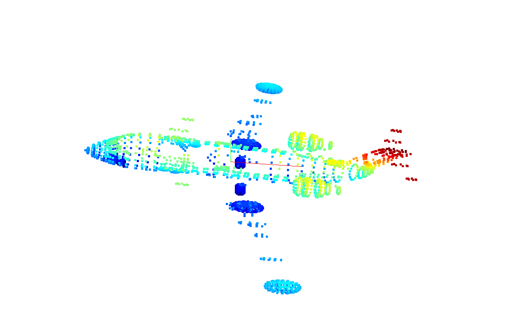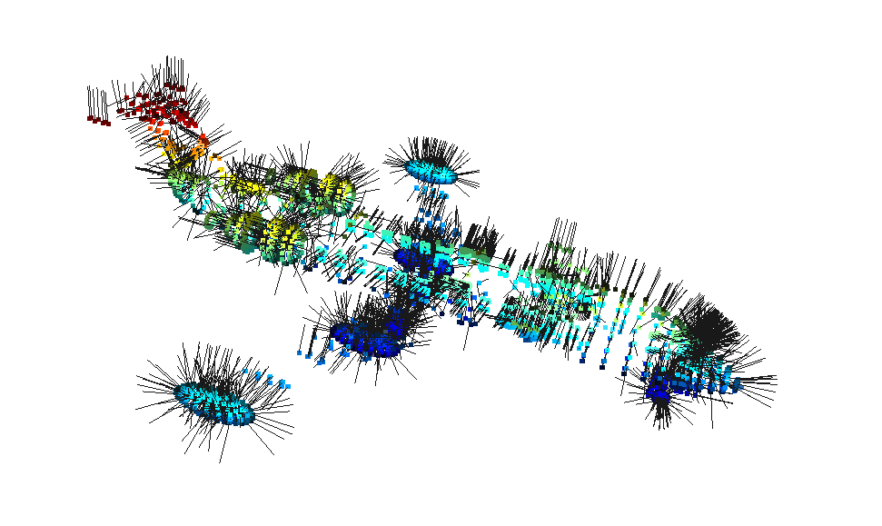
    
Fig.1 PCA and Surface Normal of the point cloud

### 1.2 Upsampling(C++)

    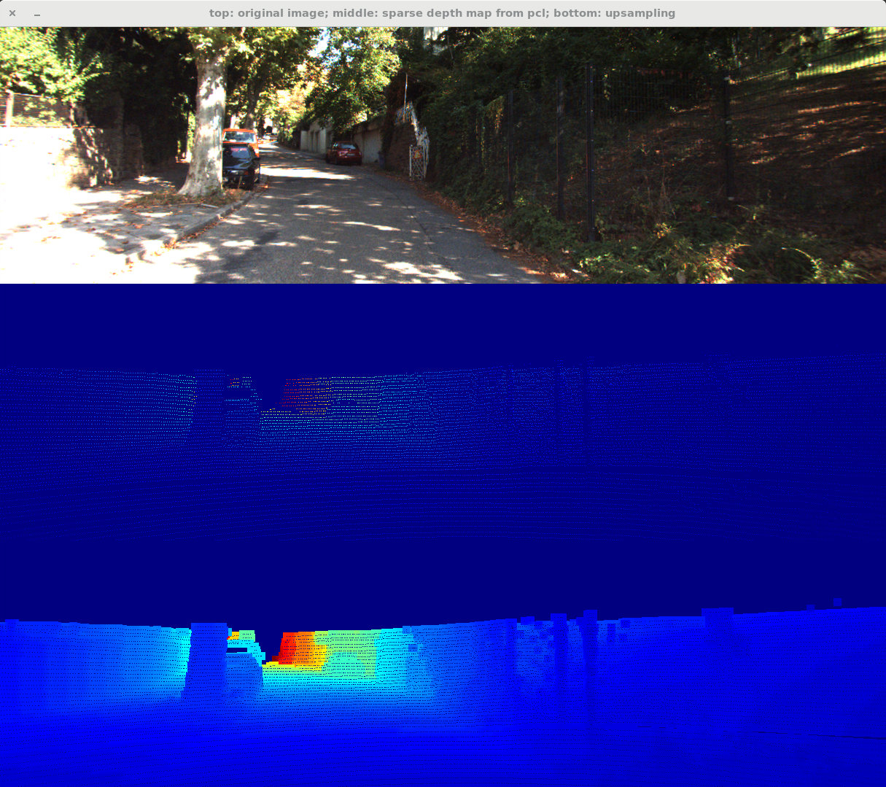
    
Fig.2 Above: RGB image; Middle: Depth image; Down: Upsampled depth image

### 2. NN Search Tree (python & C++)
~~~
My kdtree ------------
Kdtree: build 283.742ms, knn 11.855ms, radius 0.505ms, brute 13.218ms
~~~
~~~
My octree --------------
Octree: build 11727.653ms, knn 0.981ms, radius 0.732ms, brute 17.305ms
~~~
### 3. Clustering (python)
  

    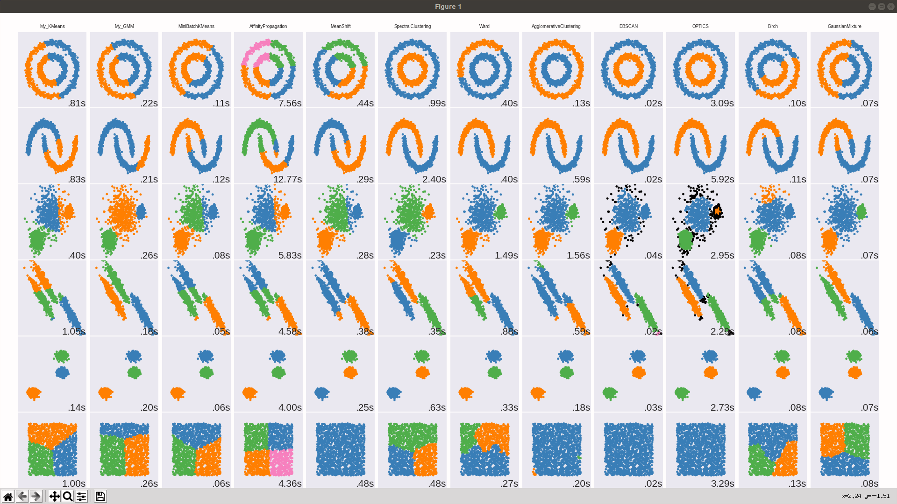  
    
Fig.3 Benchmark of clustering algorithm.  Left 1: Mykmeans; Left 2: MyGMM

### 4. Ground Segmentation and Clustering (python)
  

      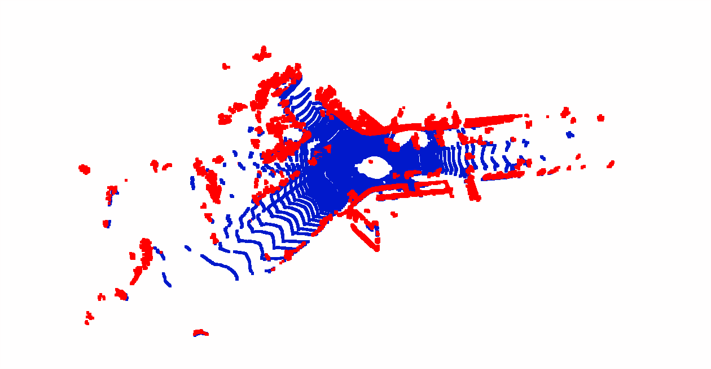
      
Fig.4 Ground segmentation(RANSAC + Least square optimization). Blue part is the segmented ground

  
 
  

      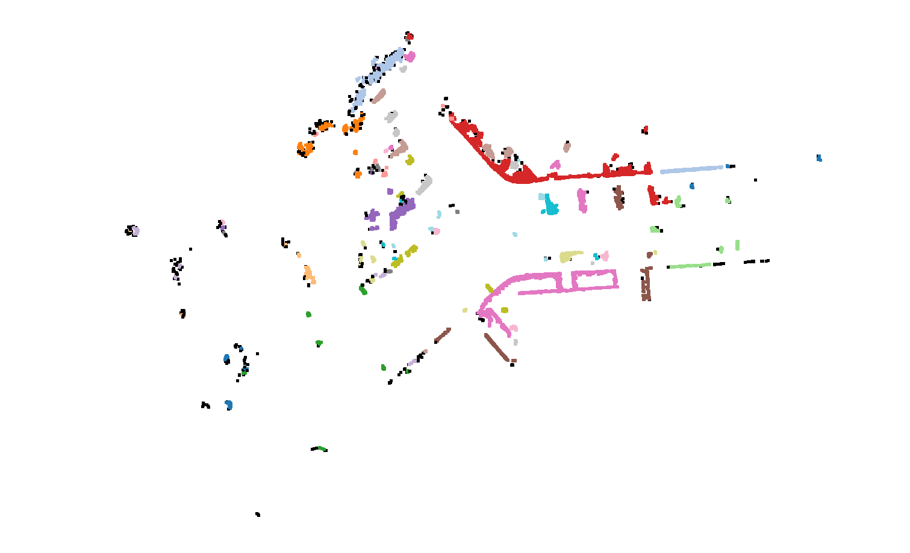
      
Fig.5 DBSCAN clustering algorithm of the point clouds after aplying ground filter 

  
 

### 5. Deep Learning for Classification (python)
  

    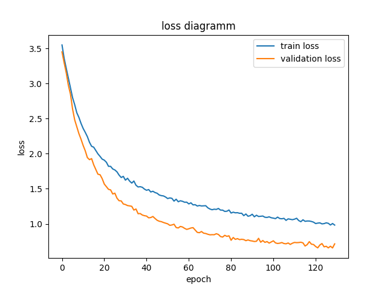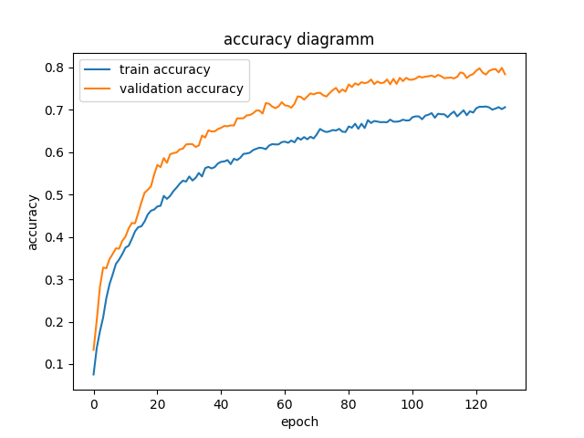
    
Fig.6 left: loss diagramm right: accuracy diagramm 

### 6. Deep Learning for Object Detection (python)

    
    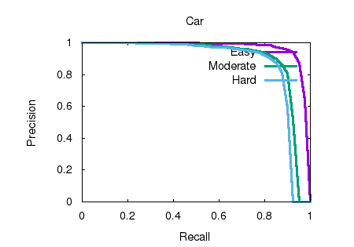
     
    

    
    
     
    
Fig.7 P-R Curve of car detection and orientation

### 7. Feature Detection (C++)

    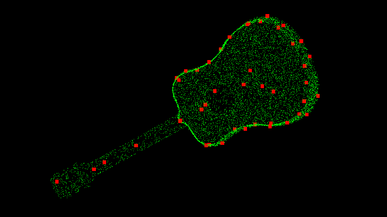
    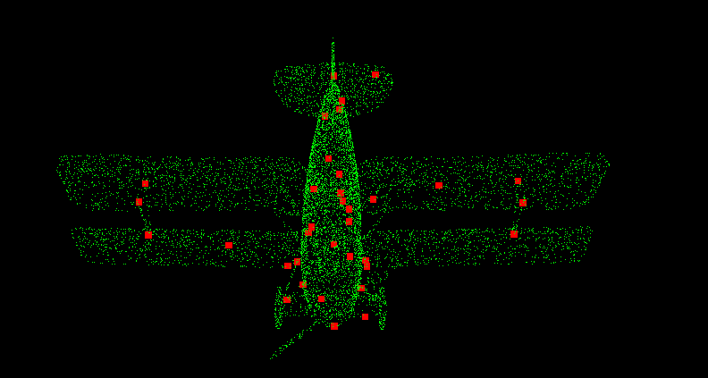
     
    
Fig.8 Feature detection of gituar and airplane

