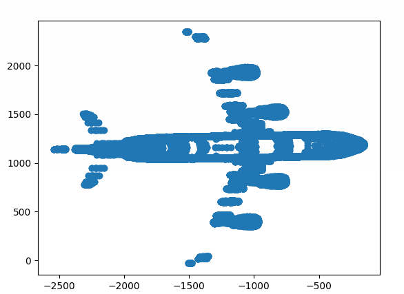
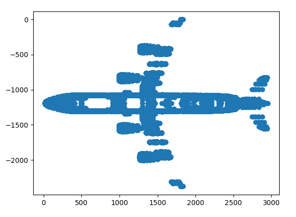
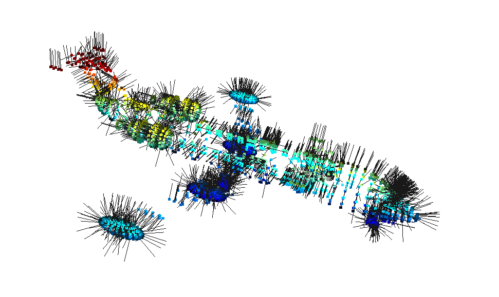

## Introduction
---------------

1. **PCA**
   ~~~ python
   def PCA(data, correlation=False, sort=True):
        # 作业1
        # 屏蔽开始
        if correlation:
            corr_data = np.corrcoef(data.T )
            eigenvectors, eigenvalues, _ = np.linalg.svd(corr_data)        

        else:
            cov_data = np.cov(data.T)
            eigenvectors, eigenvalues, _ = np.linalg.svd(cov_data)

        eigenvalues = np.sqrt(eigenvalues)
        # 屏蔽结束

        if sort:
            sort = eigenvalues.argsort()[::-1]
            eigenvalues = eigenvalues[sort]
            eigenvectors = eigenvectors[:, sort]

        return eigenvalues, eigenvectors

* 若使用cov，可视化后的点云如图
  $$cov(X,Y) = \sum_{i=1}^{N} \frac{(X_i-\overline{X})(Y_i-\overline{Y})^T}{N -1}$$

 

    
    
Fig.1 使用协方差计算的pca，红色线为主方向，绿色线为次方向

 
 
 

* 若使用correcoef
  $$\rho(X,Y) = \frac{cov(X,Y)}{\sigma_X\sigma_Y}$$
 

    
    
Fig.2 使用相关系数计算的pca，红色线为主方向，绿色线为次方向

 

* 可见， 使用协方差矩阵计算出来的主方向和次方向看上去是正确的，但是用相关系数计算出来的主方向看上去不对。这里感觉很奇怪，因为相关系数和协方差只是差了在每个轴去均值化以后除以标准差来“标准化”，也就是re-scale，方向不应该变化。
  
* 但是，用协方差和相关系数得到的主方向和次方向来做降维，得到的结果类似，所以可能是数值问题导致的差异。
  ~~~ python
  dim_reduction = v[:,:2]
  pcl_2d = np.dot(np.array(points), dim_reduction)
  plt.scatter(pcl_2d[:,0], pcl_2d[:,1])
  plt.show()
 
 
 

    
    
Fig.3 使用pca的主，次轴降采样。
    左：协方差， 右：相关系数

 
 

2. Normal Estimation
   
   ~~~ python
   # 循环计算每个点的法向量
    pcd_tree = o3d.geometry.KDTreeFlann(point_cloud_o3d)
    normals = []
    # 作业2
    # 屏蔽开始
    for i in range(points.shape[0]):
        [_, idx, _] = pcd_tree.search_knn_vector_3d(point_cloud_o3d.points[i], 20)
        knn_points = np.asarray(point_cloud_o3d.points)[idx, :]
        _, v_knn_points = PCA(knn_points)
        normals.append(v_knn_points[:,-1])

    # 由于最近邻搜索是第二章的内容，所以此处允许直接调用open3d中的函数

    # 屏蔽结束
    normals = np.array(normals, dtype=np.float64)
    # TODO: 此处把法向量存放在了normals中
    point_cloud_o3d.normals = o3d.utility.Vector3dVector(normals)
    window_name = 'normal vector of pcl'
    o3d.visualization.draw_geometries([point_cloud_o3d],"Open3D normal estimation")

 
 
 

    
     
    
Fig.4 点云的法向量估计示例图

