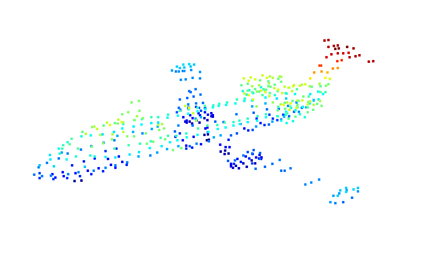
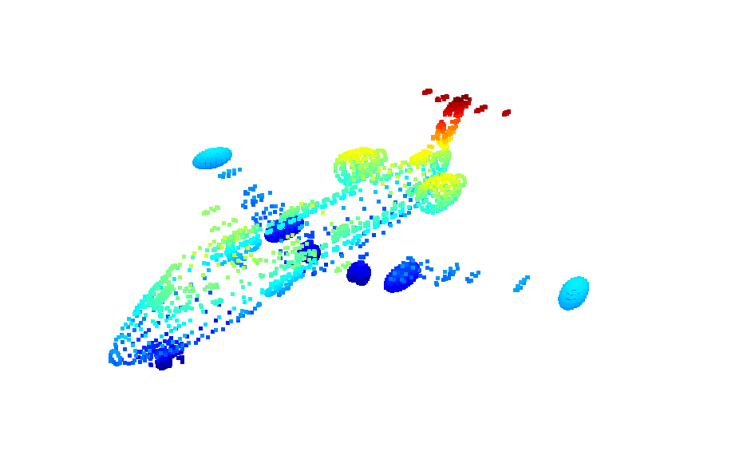
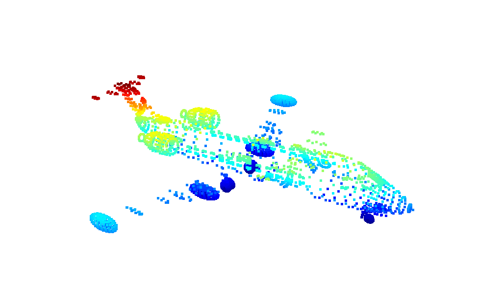
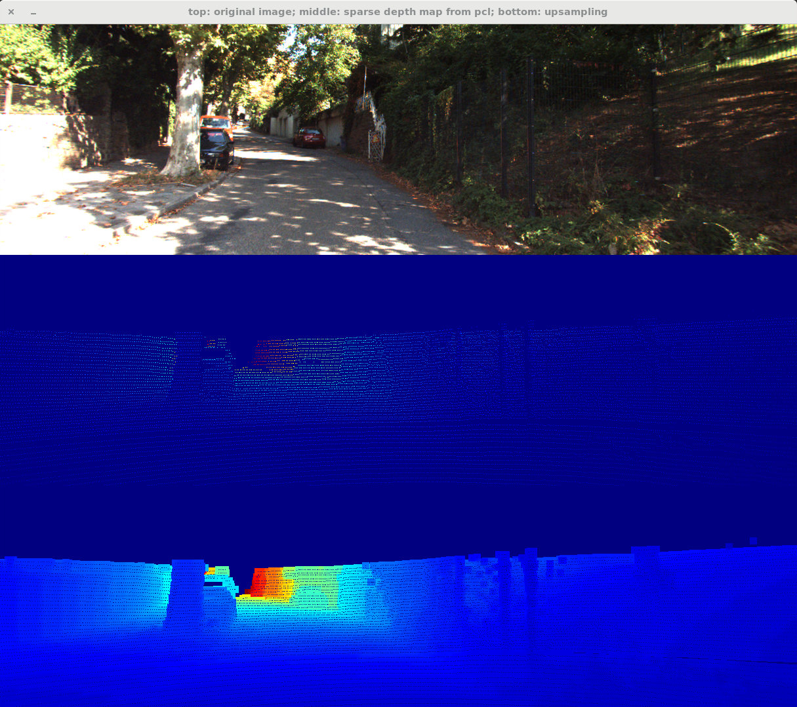

## Introduction
---------------

1. **PCA**
   ~~~ python
   def PCA(data, correlation=False, sort=True):
        # 作业1
        # 屏蔽开始
        if correlation:
            corr_data = np.corrcoef(data.T )
            eigenvectors, eigenvalues, _ = np.linalg.svd(corr_data)        

        else:
            cov_data = np.cov(data.T)
            eigenvectors, eigenvalues, _ = np.linalg.svd(cov_data)
            eigenvalues = np.sqrt(eigenvalues)
       # 屏蔽结束
   
        if sort:
            sort = eigenvalues.argsort()[::-1]
            eigenvalues = eigenvalues[sort]
            eigenvectors = eigenvectors[:, sort]
   
        return eigenvalues, eigenvectors
   ~~~

* 若使用cov，可视化后的点云如图
  $$cov(X,Y) = \sum_{i=1}^{N} \frac{(X_i-\overline{X})(Y_i-\overline{Y})^T}{N -1}$$

 

    
    
Fig.1 使用协方差计算的pca，红色线为主方向，绿色线为次方向

 
 
 

* 若使用correcoef
  $$\rho(X,Y) = \frac{cov(X,Y)}{\sigma_X\sigma_Y}$$
 

    
    
Fig.2 使用相关系数计算的pca，红色线为主方向，绿色线为次方向

 

* 可见， 使用协方差矩阵计算出来的主方向和次方向看上去是正确的，但是用相关系数计算出来的主方向看上去不对。这里感觉很奇怪，因为相关系数和协方差只是差了在每个轴去均值化以后除以标准差来“标准化”，也就是re-scale，方向不应该变化。
  
* 但是，用协方差和相关系数得到的主方向和次方向来做降维，得到的结果类似，所以可能是数值问题导致的差异。
  ~~~ python
  dim_reduction = v[:,:2]
  pcl_2d = np.dot(np.array(points), dim_reduction)
  plt.scatter(pcl_2d[:,0], pcl_2d[:,1])
  plt.show()
 
 
  ~~~
 

    
    
Fig.3 使用pca的主，次轴降采样。
    左：协方差， 右：相关系数

 
 

2. **Normal Estimation**
   
   ~~~ python
   # 循环计算每个点的法向量
    pcd_tree = o3d.geometry.KDTreeFlann(point_cloud_o3d)
    normals = []
    # 作业2
    # 屏蔽开始
    for i in range(points.shape[0]):
        [_, idx, _] = pcd_tree.search_knn_vector_3d(point_cloud_o3d.points[i], 20)
        knn_points = np.asarray(point_cloud_o3d.points)[idx, :]
        _, v_knn_points = PCA(knn_points)
        normals.append(v_knn_points[:,-1])

    # 由于最近邻搜索是第二章的内容，所以此处允许直接调用open3d中的函数

    # 屏蔽结束
    normals = np.array(normals, dtype=np.float64)
    # TODO: 此处把法向量存放在了normals中
    point_cloud_o3d.normals = o3d.utility.Vector3dVector(normals)
    window_name = 'normal vector of pcl'
    o3d.visualization.draw_geometries([point_cloud_o3d],"Open3D normal estimation")
   ~~~

 
 
 

    
     
    
Fig.4 点云的法向量估计示例图

 
 

3. **Voxel Grid Downsampling**
   ~~~ python 
   def voxel_filter(point_cloud, leaf_size):
    point_cloud = np.asarray(point_cloud)
    print("Number of point clouds is", len(point_cloud))
    filtered_points = []
    # 作业3
    # 屏蔽开始
    # compute the min or max of the point set {p1,p2,p3,...}
    x_max, y_max, z_max = np.max(point_cloud,axis = 0)
    x_min, y_min, z_min = np.min(point_cloud,axis = 0)

    # compute the dim of the voxel grid    
    Dx = (x_max - x_min) // leaf_size
    Dy = (y_max - y_min) // leaf_size
    Dz = (z_max - z_min) // leaf_size
         
    # compute voxel idx for each point
    h = list()
    
    for i in range(len(point_cloud)):
        x,y,z = point_cloud[i]
        hx = np.floor((x - x_min) / leaf_size)
        hy = np.floor((y - y_min) / leaf_size)
        hz = np.floor((z - z_min) / leaf_size) 
        h.append(int(hx + hy * Dx + hz * Dx * Dy))
    
    h_sorted = sorted(h) # 点在第几个voxel
    h_sorted_idx = np.argsort(h)
    current_voxel = list()
    
    for i in range(point_cloud.shape[0] -1):
        if h_sorted[i] == h_sorted[i + 1]:
            current_voxel.append(point_cloud[h_sorted_idx[i]])
        else:
            # point_idx = h_sorted_idx[begin: i + 1]
            current_voxel.append(point_cloud[h_sorted_idx[i]])
            filtered_points.append(np.mean(np.array(current_voxel), axis = 0))
            current_voxel.clear()
    # 屏蔽结束

    # 把点云格式改成array，并对外返回
    filtered_points = np.array(filtered_points, dtype=np.float64)
    print("Number of filtered points", len(filtered_points))
    return filtered_points
   ~~~

 
 
 

    
     
    
Fig.6 Voxel Grid下采样， leaf_size = 30.0, filtered_pts = 212

 

  * leaf_size = 0.001, 下采样的结果如下图，因为分辨率很高，所以很好的还原了原来点云的样子，其中下采样结果的点的个数为4420，总点数为11634
   

    
     
    
Fig.7 Voxel Grid下采样 leaf_size = 0.001

 
* leaf_size = 0.1, 下采样的结果如下图，也很好的还原了原来点云的样子，其中下采样结果的点的个数为4414，总点数为11634，与leaf_size = 0.01的结果类似，可能的原因是原点云本身存在一些点距离非常近，无法轻易分开。

    
     
    
Fig.8 Voxel Grid下采样 leaf_size = 0.1

 
 

* 如何理解**hash table的冲突问题**，举个例子:
     
根据ppt公式，假如一组点的参数如下所示：
   
$$x_{max} = 5.0, y_{max} = 5.0, z_{max} = 4.0$$
$$x_{min} = 0.0, y_{min} = 0.0, z_{min} = 0.0$$
所以：
 
$$leaf_{size} = 1$$
$$D_x = 5, D_y = 5, D_z = 4$$ 
$$container\_size = 5 * 5 * 4 = 100$$
对于点 [0.9,0.8.0,7], [5.0,4.3,3.9] 和 [0.1,0.1,4.0], 
 均有
$$h\%100 = 0$$
所以天南海北的点汇集到同一个0th container，出现hash table的冲突。

* 如何解决冲突的思路： 其实和之前的思路非常类似，若不解决哈希冲突，只是按照h的大小进行一次排序，并判断是否相邻点具有相同的h，若想解决哈希冲突，需要按照$h_x$,$h_y$再进行排序，判断时候加上哈希冲突的条件，就完成了解决哈希冲突的逻辑。
  ~~~ python
  def voxel_filter(point_cloud, leaf_size, random_downsampling = False):
    point_cloud = np.asarray(point_cloud)
    print("Number of point clouds is", len(point_cloud))
    filtered_points = []
    # 作业3
    # 屏蔽开始
    # compute the min or max of the point set {p1,p2,p3,...}
    x_max, y_max, z_max = np.max(point_cloud,axis = 0)
    x_min, y_min, z_min = np.min(point_cloud,axis = 0)

    # compute the dim of the voxel grid    
    Dx = (x_max - x_min) // leaf_size
    Dy = (y_max - y_min) // leaf_size
    Dz = (z_max - z_min) // leaf_size
    container_size = Dx * Dy * Dz
    # compute voxel idx for each point
    h = list()
    
    for i in range(len(point_cloud)):
        x,y,z = point_cloud[i]
        hx = np.floor((x - x_min) / leaf_size)
        hy = np.floor((y - y_min) / leaf_size)
        hz = np.floor((z - z_min) / leaf_size)
        hash_table = int(hx + hy * Dx + hz * Dx * Dy) % container_size
        h.append(np.asarray([hx, hy, hz, hash_table]))
        # h.append(hash_table)
    # h_sorted = np.asarray(sorted(h, key = cmp_to_key(lambda lhs, rhs : lhs[3] - rhs[3]))) # 点在第几个voxel
    
    h = np.asarray(h)
    # current_h_sorted_idx = np.lexsort((current_h[:,0], current_h[:,1]))
    h_sorted_idx =np.lexsort((h[:,-1], h[:,0], h[:,1])) # 按照h的最后一列排序,再按照第一列排序，再按照第二列排序
    h_sorted = h[h_sorted_idx]
    # h_sorted_idx = np.argsort(h)
    current_voxel = list()
    current_h = list()

    for i in range(point_cloud.shape[0] -1):
        if h_sorted[i, -1] == h_sorted[i + 1, -1] and not hash_table_conflict(h_sorted[i,0:3], h_sorted[i+1, 0:3]):
            current_voxel.append(point_cloud[h_sorted_idx[i]])
        else:
            current_voxel.append(point_cloud[h_sorted_idx[i]])
            if(random_downsampling == False):
                filtered_points.append(np.mean(np.array(current_voxel), axis = 0))
            else:

                random_idx = np.random.randint(len(current_voxel), size = 1)
                filtered_points.append(current_voxel[int(random_idx)])
            current_voxel.clear()
    # 屏蔽结束
  ~~~

 
* 下面对比一下是否解决哈希冲突的差异，在leaf_size = 30.0的情况下，解决哈希冲突降采样的点为525，未解决哈希冲突降采样的点为212，可见，是否解决哈希冲突对结果影响还是很显著的。
 

    
    
Fig.8 当leaf_size = 30.0时 
      左图：未解决哈希冲突，filtered_pts = 212, 右图：解决哈希冲突， filtered_pts = 525

4. **Upsampling**
   ~~~ c++
   cv::Mat apply_bilateral_filter_for_upsampling(cv::Mat img_, int size,
                                                 double sigma_position,
                                                 double sigma_pixel) {
     cv::Mat img = img_.clone();
   
     assert(size % 2 == 1);
   
     if (img.type() != CV_8UC1) {
       img.convertTo(img, CV_8UC1);
     }
   
     cv::Mat dist_map = get_gaussian_kernel(size, sigma_position);
     cv::Mat img_64f;
     img.convertTo(img_64f, CV_64FC1);
     cv::Mat result(cv::Mat::zeros(img.size(), CV_64FC1));
   
     int win_half_size = (size - 1) / 2;
     double local_weight = 0.0;
   
     double pixel_coeff = -0.5 / (sigma_pixel * sigma_pixel);
   
     double gaussian_pixel_lut[256];
     for (int pixel_val = 0; pixel_val < 256; pixel_val++) {
       double pixel_val_double = static_cast<double>(pixel_val);
       gaussian_pixel_lut[pixel_val] =
           std::exp(pixel_val_double * pixel_val_double * pixel_coeff);
     }
   
     for (int r = 0; r < img.rows; r++) {
       for (int c = 0; c < img.cols; c++) {
           // 只计算黑色点的深度
         if (img.at<uchar>(r, c) != 0) {
           continue;
         }
         double weight = 0.0;
   
         for (int r_win = -win_half_size; r_win < win_half_size + 1; r_win++) {
           for (int c_win = -win_half_size; c_win < win_half_size + 1; c_win++) {
   
             if (r + r_win < 0 || c + c_win < 0 || r + r_win > img.rows - 1 ||
                 c + c_win > img.cols - 1) {
               continue;
             }
   			//如果当前点的深度为0，则忽略其对权重的贡献
             if (img.at<uchar>(r + r_win, c + c_win) == 0) {
               continue;
             }
             int r_local = r + r_win;
             int c_local = c + c_win;
   
             if (img.at<uchar>(r_local, c_local) >= img.at<uchar>(r, c)) {
               local_weight =
                   gaussian_pixel_lut[std::abs(img.at<uchar>(r_local, c_local) -
                                               img.at<uchar>(r, c))] *
                   dist_map.at<double>(r_win + win_half_size,
                                       c_win + win_half_size);
             } else {
               local_weight =
                   gaussian_pixel_lut[std::abs(img.at<uchar>(r, c) -
                                               img.at<uchar>(r_local, c_local))] *
                   dist_map.at<double>(r_win + win_half_size,
                                       c_win + win_half_size);
             }
   
             //  compute_gaussian_pdf(0, sigma_position, square_dist);
             result.at<double>(r, c) +=
                 (local_weight * img_64f.at<double>(r_local, c_local));
             weight += local_weight;
           }
           // std::cout << '\n';
         }
         result.at<double>(r, c) /= weight;
       }
     }
   
     return result;
   }
   ~~~

    
     
    
Fig.9 bilateral filter上采样结果

* 可以看出层次感，但是效果一般，尝试过多做几次bilateral filter，但是效果还不如只做一次，感觉还是深度学习更香。
* 用depth_selection/val_selection_cropped数据集中前100个图跑了下evaluation，结果如下：
~~~ 
mean mae: 1.139972 
min  mae: 0.752594 
max  mae: 1.836417 
mean rmse: 2.754302 
min  rmse: 1.000000 
max  rmse: 5.465010 
mean inverse mae: 0.006397 
min  inverse mae: 0.004387 
max  inverse mae: 0.010852 
mean inverse rmse: 0.010376 
min  inverse rmse: 0.007380 
max  inverse rmse: 0.018656 
mean log mae: nan 
min  log mae: 0.054742 
max  log mae: 0.093017 
mean log rmse: nan 
min  log rmse: 0.072112 
max  log rmse: 0.218868 
mean scale invariant log: nan 
min  scale invariant log: 0.045422 
max  scale invariant log: 0.200372 
mean abs relative: 0.063876 
min  abs relative: 0.052401 
max  abs relative: 0.077311 
mean squared relative: 0.009025 
min  squared relative: 0.004449 
max  squared relative: 0.021669 
  