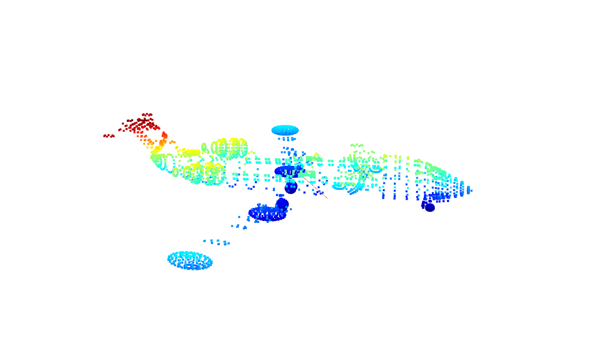
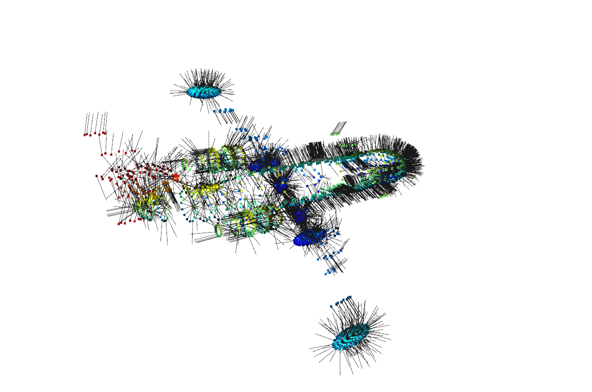
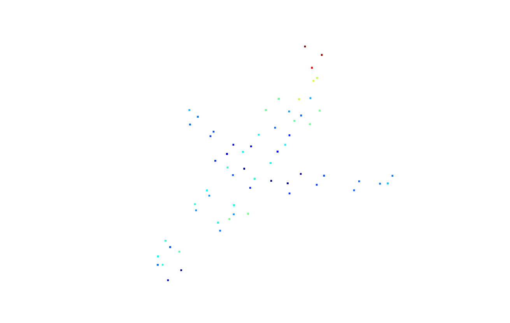
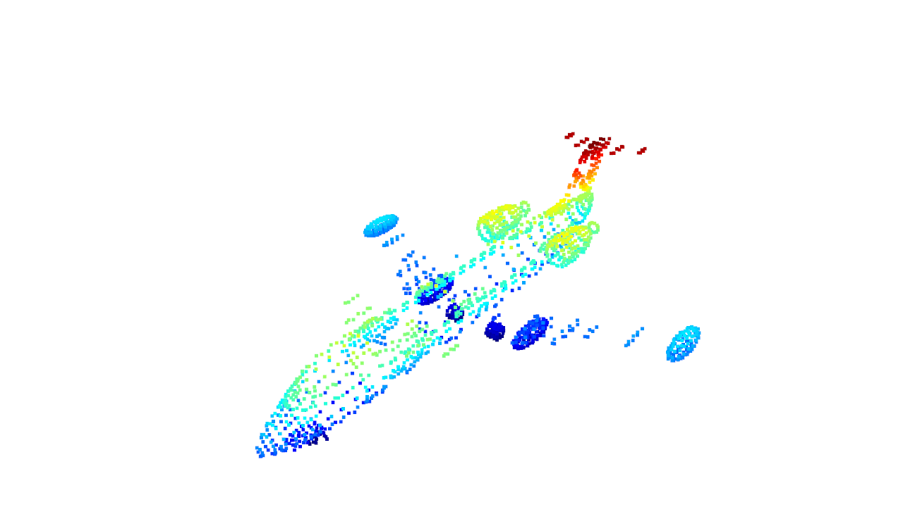
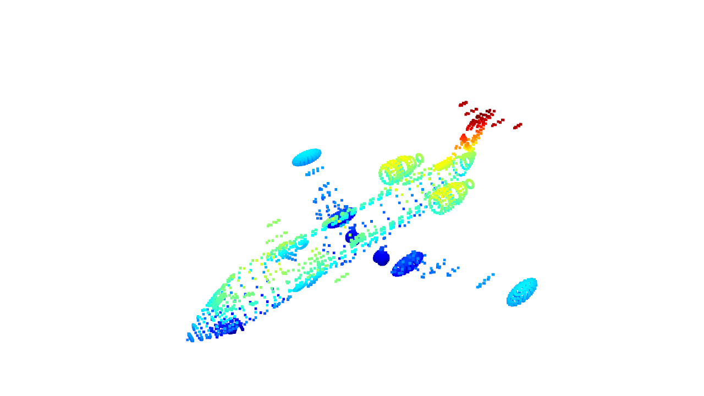

## Introduction
---------------

1. **PCA**
   ~~~ python
   def PCA(data, correlation=False, sort=True):
        # 作业1
        # 屏蔽开始
        if correlation:
            corr_data = np.corrcoef(data.T )
            eigenvectors, eigenvalues, _ = np.linalg.svd(corr_data)        

        else:
            cov_data = np.cov(data.T)
            eigenvectors, eigenvalues, _ = np.linalg.svd(cov_data)

        eigenvalues = np.sqrt(eigenvalues)
        # 屏蔽结束

        if sort:
            sort = eigenvalues.argsort()[::-1]
            eigenvalues = eigenvalues[sort]
            eigenvectors = eigenvectors[:, sort]

        return eigenvalues, eigenvectors

* using covariance，the visualization is shown below:
  $$cov(X,Y) = \sum_{i=1}^{N} \frac{(X_i-\overline{X})(Y_i-\overline{Y})^T}{N -1}$$

    
     
    
Fig1. pca of point cloud, red line indicates the main direction and green the second

 

* if using correlation coefficients:
  $$\rho(X,Y) = \frac{cov(X,Y)}{\sigma_X\sigma_Y}$$

    
     
    
Fig2. pca of point cloud, red line indicates the main direction and green the second

 

2. **Points' Normals**
   ~~~python
    # 作业2
    # 屏蔽开始
    for i in range(points.shape[0]):
        [_, idx, _] = pcd_tree.search_knn_vector_3d(point_cloud_o3d.points[i], 20)
        knn_points = np.asarray(point_cloud_o3d.points)[idx, :]
        _, v_knn_points = PCA(knn_points)
        normals.append(v_knn_points[:,-1])

    # 由于最近邻搜索是第二章的内容，所以此处允许直接调用open3d中的函数
    # 屏蔽结束

    
     
    
Fig3. Point cloud with the normals

 

3. **Voxel Downsampling**
    ~~~python
    def voxel_filter(point_cloud, leaf_size):

    filtered_points = []
    # 作业3
    # 屏蔽开始
    point_cloud = np.asarray(point_cloud)
    print("total points : ", len(point_cloud))
    x_max, y_max, z_max = np.max(point_cloud,axis = 0)
    x_min, y_min, z_min = np.min(point_cloud,axis = 0)

    Dx = (x_max - x_min) // leaf_size
    Dy = (y_max - y_min) // leaf_size
    Dz = (z_max - z_min) // leaf_size

    h = list() 
    for i in range (point_cloud.shape[0]):
        x, y, z = point_cloud[i]
        hx = np.floor((x - x_min) / leaf_size)
        hy = np.floor((y - y_min) / leaf_size)
        hz = np.floor((z - z_min) / leaf_size)
        h.append([hx + hy * Dx + hz * Dx * Dy, i])#storing pair
    h = sorted(h,key=lambda x:x[0])
    ##putting points with same h in cur and pick centroid
    filtered_points = list()
    cur_voxel = list()
    for i in range (point_cloud.shape[0] - 1):
        if (h[i][0] == h[i+1][0]):
            #put point
            cur_voxel.append(point_cloud[h[i][1]])
        else:
            #pick centroid
            cur_voxel.append(point_cloud[h[i][1]])
            [x_c, y_c, z_c]= np.mean(np.asarray(cur_voxel),axis = 0)
            filtered_points.append([x_c,y_c,z_c])
            cur_voxel.clear()
    # 屏蔽结束

    # 把点云格式改成array，并对外返回
    filtered_points = np.array(filtered_points, dtype=np.float64)
    print("filtered_points ",len(filtered_points))
    return filtered_points

* setting leaf_size to 100.0 results in 64 points, roughly represents the object

    
     
    
Fig4. Point cloud after voxel down sampling, 64 points in total

 

* setting leaf_size to 10.0 results in 1920 points, almost reconstructs whole point cloud

    
     
    
Fig5. Point cloud after voxel down sampling, 1920 points in total

 

* setting leaf_size to 0.1 results in 4414 points, further amplifiying resolution doesn't add as many points, 0.01 results in 4419 points for example, only make a minor difference with 5 points.
* The reason behind it might be that, the remaining 7000ish points are too close to their neighbors to be seperated.

    
     
    
Fig6. Point cloud after voxel down sampling, 4414 points in total

 
authored by : Guanzhi Feng