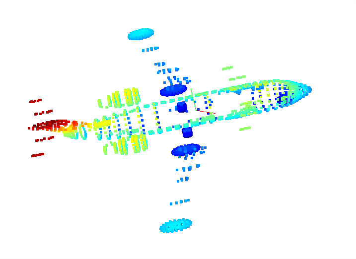

## Introduction
---------------

1. **PCA**
   ~~~ python
   def PCA(data, correlation=False, sort=True):
        # 作业1
        # 屏蔽开始
        if correlation:
            corr_data = np.corrcoef(data.T )
            eigenvectors, eigenvalues, _ = np.linalg.svd(corr_data)        

        else:
            cov_data = np.cov(data.T)
            eigenvectors, eigenvalues, _ = np.linalg.svd(cov_data)

        eigenvalues = np.sqrt(eigenvalues)
        # 屏蔽结束

        if sort:
            sort = eigenvalues.argsort()[::-1]
            eigenvalues = eigenvalues[sort]
            eigenvectors = eigenvectors[:, sort]

        return eigenvalues, eigenvectors

* 若使用cov，可视化后的点云如图
  $$cov(X,Y) = \sum_{i=1}^{N} \frac{(X_i-\overline{X})(Y_i-\overline{Y})^T}{N -1}$$

 

    
    
Fig.1 使用协方差计算的pca，红色线为主方向，绿色线为次方向

 
 
 

* 若使用correcoef
  $$\rho(X,Y) = \frac{cov(X,Y)}{\sigma_X\sigma_Y}$$
 

    
    
Fig.2 使用相关系数计算的pca，红色线为主方向，绿色线为次方向

 

* 可见， 使用协方差矩阵计算出来的主方向和次方向看上去是正确的，但是用相关系数计算出来的主方向看上去不对。这里感觉很奇怪，因为相关系数和协方差只是差了在每个轴去均值化以后除以标准差来“标准化”，也就是re-scale，方向不应该变化。
  
* 但是，用协方差和相关系数得到的主方向和次方向来做降维，得到的结果类似，所以可能是数值问题导致的差异。
  ~~~ python
  dim_reduction = v[:,:2]
  pcl_2d = np.dot(np.array(points), dim_reduction)
  plt.scatter(pcl_2d[:,0], pcl_2d[:,1])
  plt.show()
 
 
 

    
    
Fig.3 使用pca的主，次轴降采样。
    左：协方差， 右：相关系数

 
 

2. Normal Estimation
   
   ~~~ python
   # 循环计算每个点的法向量
    pcd_tree = o3d.geometry.KDTreeFlann(point_cloud_o3d)
    normals = []
    # 作业2
    # 屏蔽开始
    for i in range(points.shape[0]):
        [_, idx, _] = pcd_tree.search_knn_vector_3d(point_cloud_o3d.points[i], 20)
        knn_points = np.asarray(point_cloud_o3d.points)[idx, :]
        _, v_knn_points = PCA(knn_points)
        normals.append(v_knn_points[:,-1])

    # 由于最近邻搜索是第二章的内容，所以此处允许直接调用open3d中的函数

    # 屏蔽结束
    normals = np.array(normals, dtype=np.float64)
    # TODO: 此处把法向量存放在了normals中
    point_cloud_o3d.normals = o3d.utility.Vector3dVector(normals)
    window_name = 'normal vector of pcl'
    o3d.visualization.draw_geometries([point_cloud_o3d],"Open3D normal estimation")

 
 
 

    
     
    
Fig.4 点云的法向量估计示例图

 
 

3. Voxel Grid Downsampling
   ~~~ python 
   def voxel_filter(point_cloud, leaf_size):
    point_cloud = np.asarray(point_cloud)
    print("Number of point clouds is", len(point_cloud))
    filtered_points = []
    # 作业3
    # 屏蔽开始
    # compute the min or max of the point set {p1,p2,p3,...}
    x_max, y_max, z_max = np.max(point_cloud,axis = 0)
    x_min, y_min, z_min = np.min(point_cloud,axis = 0)

    # compute the dim of the voxel grid    
    Dx = (x_max - x_min) // leaf_size
    Dy = (y_max - y_min) // leaf_size
    Dz = (z_max - z_min) // leaf_size
         
    # compute voxel idx for each point
    h = list()
    
    for i in range(len(point_cloud)):
        x,y,z = point_cloud[i]
        hx = np.floor((x - x_min) / leaf_size)
        hy = np.floor((y - y_min) / leaf_size)
        hz = np.floor((z - z_min) / leaf_size) 
        h.append(int(hx + hy * Dx + hz * Dx * Dy))
    
    h_sorted = sorted(h) # 点在第几个voxel
    h_sorted_idx = np.argsort(h)
    current_voxel = list()
    
    for i in range(point_cloud.shape[0] -1):
        if h_sorted[i] == h_sorted[i + 1]:
            current_voxel.append(point_cloud[h_sorted_idx[i]])
        else:
            # point_idx = h_sorted_idx[begin: i + 1]
            current_voxel.append(point_cloud[h_sorted_idx[i]])
            filtered_points.append(np.mean(np.array(current_voxel), axis = 0))
            current_voxel.clear()
    # 屏蔽结束

    # 把点云格式改成array，并对外返回
    filtered_points = np.array(filtered_points, dtype=np.float64)
    print("Number of filtered points", len(filtered_points))
    return filtered_points

 
 
 

    
     
    
Fig.6 Voxel Grid下采样

 

  * leaf_size = 0.001, 下采样的结果如下图，因为分辨率很高，所以很好的还原了原来点云的样子，其中下采样结果的点的个数为4420，总点数为11634
   

    
     
    
Fig.7 Voxel Grid下采样 leaf_size = 0.001

 
* leaf_size = 0.1, 下采样的结果如下图，也很好的还原了原来点云的样子，其中下采样结果的点的个数为4414，总点数为11634，与leaf_size = 0.01的结果类似，可能的原因是原点云本身存在一些点距离非常近，无法轻易分开。

    
     
    
Fig.8 Voxel Grid下采样 leaf_size = 0.1

