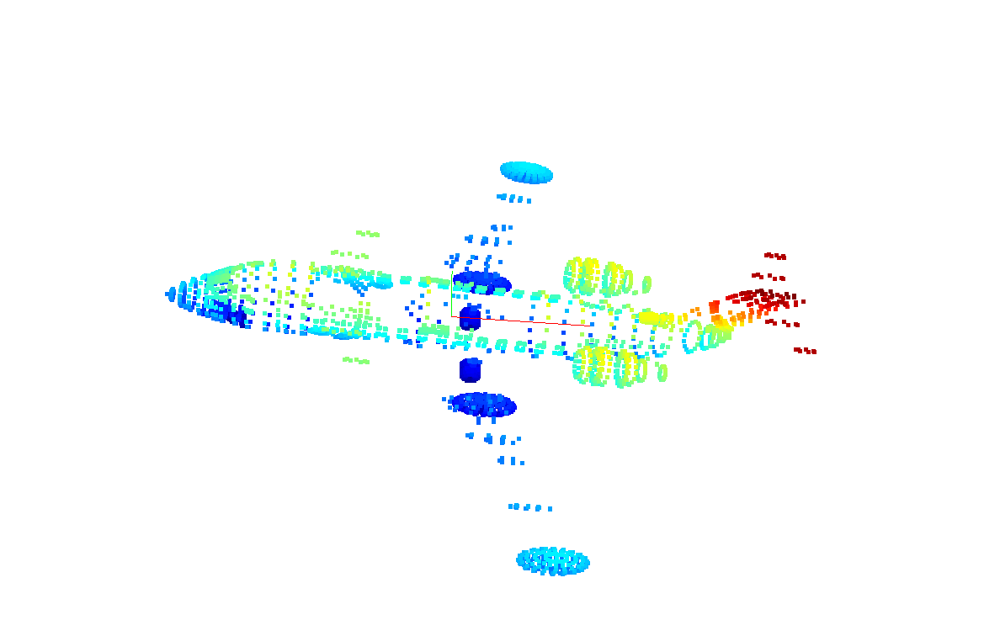
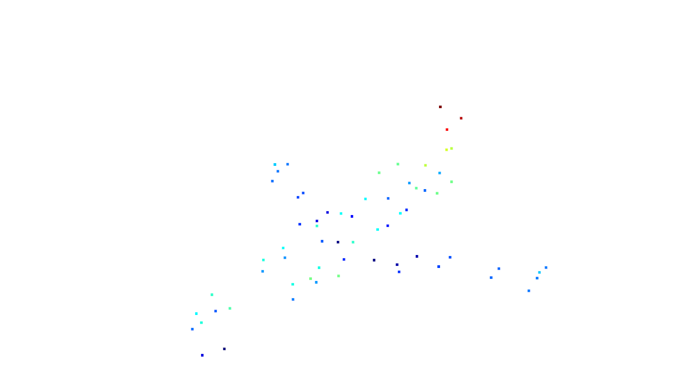
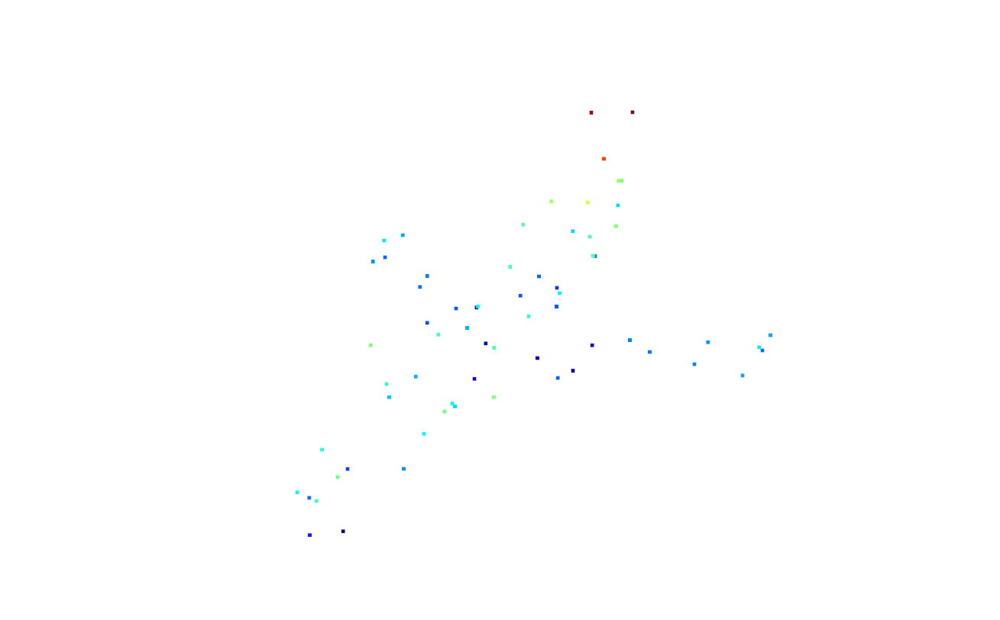
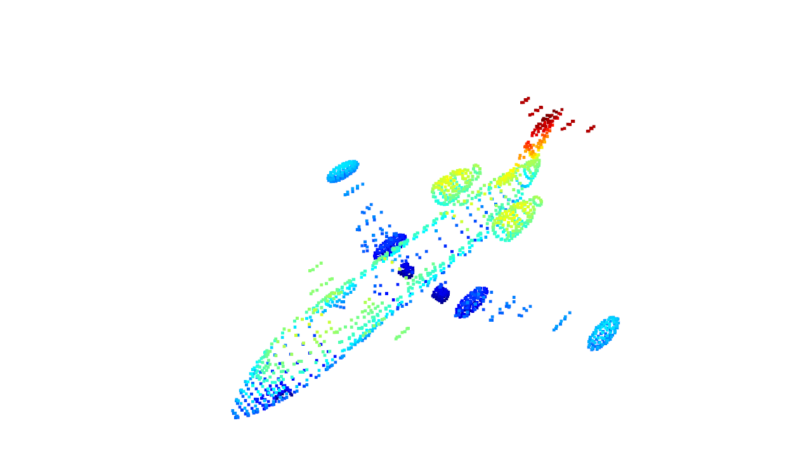

## Introduction
---------------

1. **PCA**
   ~~~ python
   def PCA(data, correlation=False, sort=True):
        # 作业1
        # 屏蔽开始
        if correlation:
            corr_data = np.corrcoef(data.T )
            eigenvectors, eigenvalues, _ = np.linalg.svd(corr_data)        

        else:
            cov_data = np.cov(data.T)
            eigenvectors, eigenvalues, _ = np.linalg.svd(cov_data)

        eigenvalues = np.sqrt(eigenvalues)
        # 屏蔽结束

        if sort:
            sort = eigenvalues.argsort()[::-1]
            eigenvalues = eigenvalues[sort]
            eigenvectors = eigenvectors[:, sort]

        return eigenvalues, eigenvectors

* using covariance，the visualization is shown below:
  $$cov(X,Y) = \sum_{i=1}^{N} \frac{(X_i-\overline{X})(Y_i-\overline{Y})^T}{N -1}$$

    
     
    
Fig1. pca of point cloud, red line indicates the main direction and green the second

 

* if using correlation coefficients:
  $$\rho(X,Y) = \frac{cov(X,Y)}{\sigma_X\sigma_Y}$$

    
     
    
Fig2. pca of point cloud, red line indicates the main direction and green the second

 

2. **Points' Normals**
   ~~~python
    # 作业2
    # 屏蔽开始
    for i in range(points.shape[0]):
        [_, idx, _] = pcd_tree.search_knn_vector_3d(point_cloud_o3d.points[i], 20)
        knn_points = np.asarray(point_cloud_o3d.points)[idx, :]
        _, v_knn_points = PCA(knn_points)
        normals.append(v_knn_points[:,-1])

    # 由于最近邻搜索是第二章的内容，所以此处允许直接调用open3d中的函数
    # 屏蔽结束

    
     
    
Fig3. Point cloud with the normals

 

3. **Voxel Downsampling**
    ~~~python
    def hash_conflict(a,b):
        if(a[1] != b[1] or a[2] != b[2] or a[3] != b[3]):
            return True
        return False

    def voxel_filter(point_cloud, leaf_size, random_sampling = False):

        filtered_points = []
        # 作业3
        # 屏蔽开始
        point_cloud = np.asarray(point_cloud)
        print("total points : ", len(point_cloud))
        x_max, y_max, z_max = np.max(point_cloud,axis = 0)
        x_min, y_min, z_min = np.min(point_cloud,axis = 0)

        Dx = (x_max - x_min) // leaf_size
        Dy = (y_max - y_min) // leaf_size
        Dz = (z_max - z_min) // leaf_size
        container_size = Dx * Dy * Dz 

        h = list() 
        for i in range (point_cloud.shape[0]):
            x, y, z = point_cloud[i]
            hx = np.floor((x - x_min) / leaf_size)
            hy = np.floor((y - y_min) / leaf_size)
            hz = np.floor((z - z_min) / leaf_size)
            h.append([(hx + hy * Dx + hz * Dx * Dy) % container_size, hx, hy, hz, i])#storing pair
        h = np.asarray(h)
        h_index = np.lexsort((h[:,0], h[:,1], h[:,2], h[:,3]))
        H = list()
        for i in range(len(h_index)):
            H.append(h[h_index[i]])
        #now H stores all points, they are all sorted according to different dimensions(h,hx,hy,hz)
    
        filtered_points = list()
        cur_voxel = list()
        cur_voxel.append(point_cloud[int(H[0][4])])#first point can't be conflicted by definition. also avoiding empty cur_voxel

        for i in range(1 , len(h)):
            if (H[i][0] == H[i-1][0] and not hash_conflict(H[i],H[i-1])):
                #put point if it is not conflicted and have same voxel index.
                cur_voxel.append(point_cloud[int(H[i][4])])
            else:
                #otherwise pick sample point from currect voxel then clear it and add this point into it 
                if(random_sampling == False):
                    [x_c, y_c, z_c] = np.mean(np.asarray(cur_voxel),axis = 0)
                else:
                    index = np.random.choice(np.asarray(cur_voxel).shape[0], 1)
                    [x_c, y_c, z_c] = cur_voxel[index[0]]
                filtered_points.append([x_c,y_c,z_c])
                cur_voxel.clear()
                cur_voxel.append(point_cloud[int(H[i][4])])
        # 屏蔽结束

        # 把点云格式改成array，并对外返回
        filtered_points = np.array(filtered_points, dtype=np.float64)
        print("sample points : ",len(filtered_points))
        return filtered_points

* setting leaf_size to 100.0 results in 66 points, roughly represents the object

    
     
    
Fig4. Point cloud after voxel down sampling, picking by centroid, 66 points in total

    
     
    
Fig5. Point cloud after voxel down sampling, picking by random, 66 points in total

 

* setting leaf_size to 10.0 results in 1922 points, almost reconstructs whole point cloud

    
     
    
Fig6. Point cloud after voxel down sampling, 1922 points in total

 

* setting leaf_size to 0.1 results in 4414 points, further amplifiying resolution doesn't add as many points, 0.01 results in 4419 points for example, only make a minor difference with 5 points.
* The reason behind it might be that, the remaining 7000ish points are too close to their neighbors to be seperated.

    
     
    
Fig7. Point cloud after voxel down sampling, 4414 points in total

 

* How to  solve hash conflict:
    Sort points not only according to voxel index, but also according to hx,hy,hz. This way among the points whose voxel index are the same, hash conflicted points are segmented, thus every segment can be treated as points with a new voxel index(which is the same as the one of those not conflicted points but since they are already cleared so it's "new").
   
authored by : Guanzhi Feng