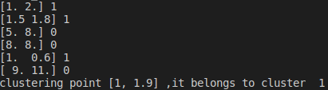
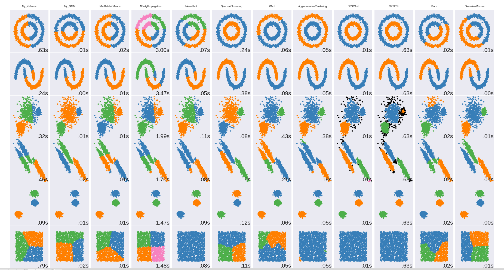
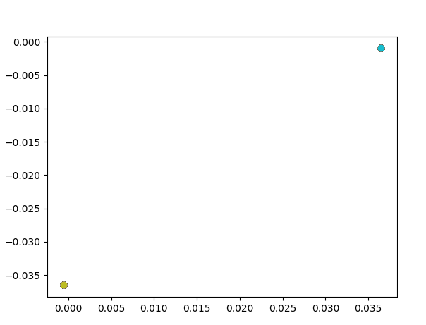
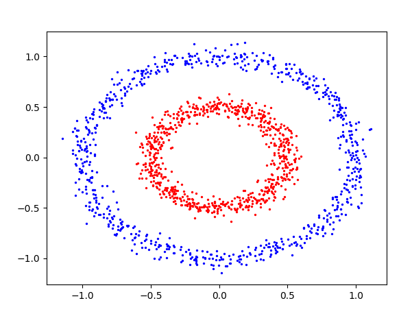

## Clustering
---------------

1.***K-means***

~~~python
    import numpy as np
    import random

    class point():
        def __init__(self, data, label):
            self.data = data
            self.label = label

        def __str__(self):
            output = ''
            output += str(self.data) + ' ' + str(self.label)
            return output

    def printdata(points):
        for d in points:
            print(d)

    def pick_centers(data, k):
        centers = [[] for i in range(k)]
        if data[0].label is -1:
            #random
            centers = random.sample(data,k)
            for i in range(k):
                centers[i] = centers[i].data 
        else:
            for po in data:
                centers[po.label].append(po.data)

            for i in range(k):
                centers[i] = np.mean(centers[i], axis=0)

        return centers

    class K_Means(object):
        # k是分组数；tolerance‘中心点误差’；max_iter是迭代次数
        def __init__(self, n_clusters=2, tolerance=0.0001, max_iter=300):
            self.k_ = n_clusters
            self.tolerance_ = tolerance
            self.max_iter_ = max_iter
            self.cluster_centers_ = []
            self.point_with_labels = []

        def fit(self, data):
            # 作业1
            # 屏蔽开始
            iteration = 0
            myData = []
            prev_centers = [[1e10,1e10] for i in range(self.k_)]
            J = 1e10
            for p in data:
                myData.append(point(p,-1))

            while J > self.tolerance_ and iteration < self.max_iter_:
                centers = pick_centers(myData, self.k_)
                J = sum(np.linalg.norm(prev_centers - np.asarray(centers),axis = 1))
                prev_centers = centers
                for samp in myData:
                    dist = []
                    for c in centers:
                        d = np.linalg.norm(samp.data - c)
                        dist.append(d)
                    samp.label = np.argmin(dist)

                iteration += 1
            self.point_with_labels = myData
            self.cluster_centers_ = centers
            # 屏蔽结束

        def predict(self, p_datas):
            result = []
            # 作业2
            # 屏蔽开始
            for data in p_datas:
                result.append(point(data,-1))

            for p in result:
                dist = []
                for c in self.cluster_centers_:
                    d = np.linalg.norm(p.data - c)
                    dist.append(d)
                p.label = np.argmin(dist)        
            
            for i in range(len(result)):
                result[i] = result[i].label
            # 屏蔽结束
            return result

    if __name__ == '__main__':
        x = np.array([[1, 2], [1.5, 1.8], [5, 8], [8, 8], [1, 0.6], [9, 11]])
        k_means = K_Means(n_clusters=2)
        k_means.fit(x)
        printdata(k_means.point_with_labels)

        test_point = [1,1.9] 
        cat = k_means.predict([test_point])
        print("clustering point",test_point, ",it belongs to cluster ", cat[0])

~~~
* Here the classification of point [1,1.9] is predicted, as is shown in the figure below.

    
     
    
Fig1. clustering of 6 given points and prediction of new point (1,1.9)

 

2.***GMM***

* using EM-algorithm. E-step computes p(z|x) and M-step updates model parameters using maximum likelihood

~~~python
def gaussian_log_density(samples: np.ndarray, mean: np.ndarray, covariance: np.ndarray):
    dim = mean.shape[0]
    chol_covariance = np.linalg.cholesky(covariance)
    logdet = 2 * np.sum(np.log(np.diagonal(chol_covariance) + 1e-25))
    chol_inv = np.linalg.inv(chol_covariance)
    exp_term = np.sum(np.square((samples - mean) @ chol_inv.T), axis=-1)
    return -0.5 * (dim * np.log(2 * np.pi) + logdet + exp_term)

class GMM(object):
    def __init__(self, n_clusters, max_iter=50):
        self.n_clusters = n_clusters
        self.max_iter = max_iter
        self.covs = None
        self.means = None
        self.weights = None
        self.prev_means = None
        ##TODO:better way to initialize
    
    # 屏蔽开始
    # 更新pi  
    def init(self,data: ndarray):
        init_centers_idx = []
        for i in range(self.n_clusters):
            center = random.choice(data)
            index = np.argwhere(data == center)[0][0]

            init_centers_idx.append(index)
            # np.random.seed(0)
            init_centers_datas = []
            init_centers_datas.append(center)
        self.means = data[init_centers_idx]
        self.covs = np.tile(np.eye(data.shape[-1])[None, ...], [self.n_clusters, 1, 1])
        self.weights = np.ones(self.n_clusters) / self.n_clusters
    

    def e_step(self, data: ndarray):
        # compute p(x|z)
        densities = []
        for i in range(len(self.weights)):
            densities.append(np.exp(gaussian_log_density(data, self.means[i], self.covs[i])))
        densities = np.stack(densities, -1) # list to array (2000,3)

        # compute p(x,z) = p(x|z)p(z)
        joint_densities = densities * self.weights[None,...]

        # compute p(z|x) = p(x,z) / p(x) = p(x,z) / sum_z p(x,z)
        responsibilities = joint_densities / np.sum(joint_densities, -1, keepdims = True)#array(2000,3)

        return responsibilities

    # 屏蔽结束
    def m_step(self, data: ndarray, responsibilities):

        self.prev_means = self.means

        # update weights
        unnormalized_weights = np.sum(responsibilities, axis = 0)#array(1,3) Nk
        self.weights = unnormalized_weights / len(data)

        # update means
        data_weights = responsibilities / unnormalized_weights[None, :]

        weighted_data = data_weights[...,None] * data[:,None,:]
        self.means = np.sum(weighted_data, axis = 0)
        
        # update cov
        diffferences = data[:, None] - self.means[None]
        outer_products = diffferences[:,:,None] * diffferences[...,None]
        weighted_outer_products = data_weights[..., None, None] * outer_products
        self.covs = np.sum(weighted_outer_products, axis=0)
        # 屏蔽结束
    
    def fit(self, data, vis = False):
        # 作业3
        # 屏蔽开始
        self.init(data)
        for i in range(self.max_iter):
            responsibilities = self.e_step(data)
            self.m_step(data, responsibilities)
            '''if i % 5 == 0 and vis != None:
                vis_2d_gmm(data, self.weights, self.means, self.covs, title ="After Itaration {:02d}".format(i))'''
            if i != 0 and np.linalg.norm(np.asarray(self.prev_means) - np.asarray(self.means)) < 0.01:
                break
            # 屏蔽结束
        return
    
    def predict(self, data):
        # 屏蔽开始
        #return 3 gamma?
        responsibilities = self.e_step(data)
        # 屏蔽结束
        return np.argmax(responsibilities, axis = 1)
~~~

* initializing centers randomly results in unstable clustering, it sometimes works and sometimes not

    
     
    
Fig2. comparision of different clustering methods 

3.***Spectral Clustering***

~~~python
    #build graph to get adjacency matrix
    #compute unnormalized laplacian L
    #compute the first smallest k eigenvectors of v1,v2,v3 of L
    #let V n*k be the matrix containing the vectors v1,v2,v3 of as columns
    #for i = 1,...n, let yi be the vector corresponding to the i-th row of V
    #Cluster the points{yi} with k-means algorithm into clusterC1..Ck
    #the final output clusters A1,...Ak
    import numpy as np
    from sklearn import cluster, datasets
    import matplotlib.pyplot as plt
    from scipy.spatial import KDTree

    def buildGraph(data):
        n = len(data)
        adjacencyMatrix = np.zeros((n,n))
        tree = KDTree(data, leafsize=8)
        for i in range(n):
            neighbors = tree.query_ball_point(data[i], r = 0.2)##matters a lot
            diff = np.linalg.norm(data[i] - data[neighbors], axis = 1)
            adjacencyMatrix[i,neighbors] = diff

        return adjacencyMatrix

    def computeFeatures(adjacencyMatrix, k):
        Dvec = np.sum(adjacencyMatrix, axis = 1)
        D = np.diag(Dvec)
        L = D - adjacencyMatrix

        eigenvalues, eigenvectors = np.linalg.eig(L)
    
        eigenvectors = eigenvectors[:,np.argsort(eigenvalues)[:2]]
        return eigenvectors

    if __name__ == '__main__':
        #x = np.array([[1, 2], [1.5, 1.8], [5, 8], [8, 8], [1, 0.6], [9, 11]])

        n_samples = 1500
        noisy_circles = datasets.make_circles(n_samples = n_samples, factor = 0.5, noise = 0.05)
        X,label = noisy_circles

        adj = buildGraph(X)
        ys = computeFeatures(adj,2)
        #print(ys)

        kmeans = cluster.KMeans(n_clusters=2)
        kmeans.fit(ys)
        color =  ['b','r']
        '''for i in range(ys.shape[0]):
            plt.scatter(ys[i][0], ys[i][1])
        plt.show()'''

        for i in range(X.shape[0]):
            plt.scatter(X[i][0], X[i][1], c = color[kmeans.labels_[i]], s=2)

        plt.show()
~~~

    
     
    
Fig3. spectral clustering on 2-cluster ring data, points' features' 2D visualization 

    
     
    
Fig3. spectral clustering on 2-cluster ring data 

