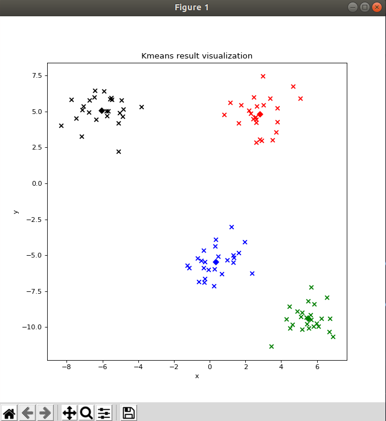
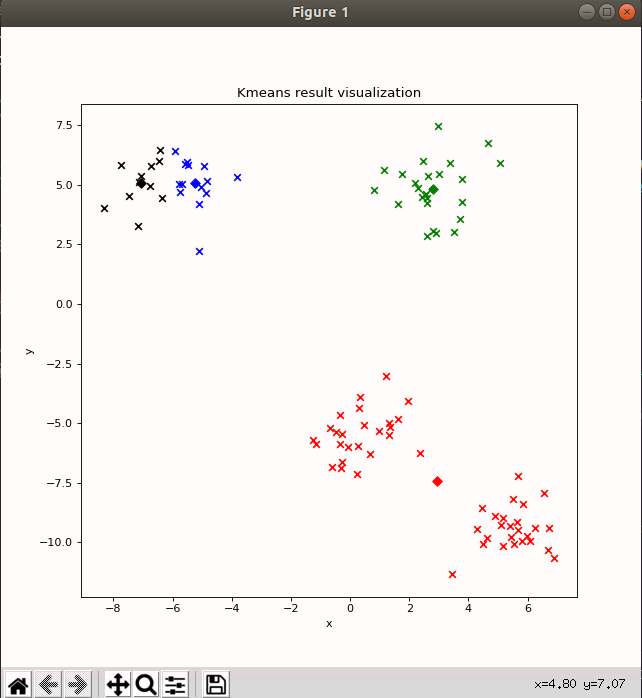

# 第三章作业 聚类算法

1. **K Means**
     
* K Means 的基本思想如下，假设需要聚K类：
~~~ pseudocode
  1. 在所给定的数据中随机选取K个点作为中心点
  2. while(不满足终止条件):
     1. 固定中心点，更新数据集每个点的label
     2. 固定每个点的label，更新聚类中心
~~~

* 根据上述逻辑，可以发现每个数据具有两个attributes, feature & label，所以我写了一个小class，Sample用于存储每个点以及它对应的label
~~~ python
class Sample(object):
    def __init__(self, data, label = -1):
        self.data = data
        self.label = label
~~~

* 根据伪代码逻辑，代码框架如下：
  ~~~ python
    self.samples = [(Sample(data)) for data in datas]
    self.centers = init_center(datas, self.k_)
    tolerance = 1e10
    iteration = 0
    while(tolerance > self.tolerance_ and iteration < self.max_iter_):
        
        iteration += 1
        self.samples = update_label(self.samples, self.centers)
        
        last_centers,centers = update_center(self.centers,self.samples,self.k_)
  
      tolerance = compute_distance(last_centers, centers)
        
        print("Iteration : {}, Tolerance : {}".format(iteration, tolerance))
  ~~~
  
* 每一个函数的实现细节可以参考KMeans_components.py文件。

* 跑benchmark之前，先用自己的测试函数可视化一下，一些bug也是在这个小的测试数据上跑的时候找到的

    
    
Fig.3 K Means的结果

 

* 由于初始化完全随机，所以无法保证聚类质量。
 
* 后面在这个网站上看到了kmeansplusplus算法，可以改善初始化点比较随机的缺点，https://www.cnblogs.com/yixuan-xu/p/6272208.html. 实现之后发现对于上图中cluster比较明显的点集，可以轻松分对，并且收敛比较快，当然初始化会比之前更加费时。 
* kmeans++ 代码如下:
  
~~~ python
def init_center_plusplus(datas, k):
    center = random.choice(datas)
    
    # np.random.seed(0)
    init_centers_datas = []
    init_centers_datas.append(center)
    
    flag = k-1 
    
    while(flag):
        
        distances = compute_min_dist_through_datas_and_centers(init_centers_datas, datas)
        # print(distances)
        center = np.random.choice(distances, p = distances.ravel())
        index = np.argwhere(distances == center)[0][0]
        init_centers_datas.append(datas[index])
        flag -= 1

    init_centers = [[] for i in range(k)]

    for i in range(k):
        init_centers[i] = Sample(init_centers_datas[i], i)

    return init_centers
~~~

## 2. EM算法求解GMM
### 1. EM 算法
这里想稍微整理下公式，因为觉得老师课件给的公式太数学了，符号有点晕。
* Mixture Models是一个 instance of **latent variable models**，由观测数据：**samples** 以及latent variables **z** 组成
  * parametric model: $p(x,z|\theta)$ 
  * Marginal distribution: $p(x|\theta) = \sum_z p(x, z|\theta)$
  * marginal log-likelihood:  
    $$ 
    \begin{aligned}
    L &= \log\mathcal{L}(\theta) \\ 
      &=\log P(x|\theta) \\
      &=\sum_{i=1}^n\log P(x_i|\theta) \\
      &=\sum_{i=1}^n\log (\sum_z P(x_i,z|\theta))\\
      &=\sum_{i=1}^n\log (\sum_k P(x_i,k|\mu_k,\sigma_k))\\
      &=\sum_{i=1}^n\log (\sum_k P(k)P(x_i|\mu_k,\sigma_k)\\
    \end{aligned}
    $$
  * 由于log,求和等，导致$L$很难求导，所以引入EM算法。
  
* EM decomposition
  $$ 
    \begin{aligned}
    \log{P(x|\theta)} &= \sum_z q(z)\log P(x|\theta) \\ 
      &=\sum_z q(z) (\log P(x,z|\theta) - \log P(z|x)) \\
      &=\sum_z q(z) (\log P(x,z|\theta) - \log q(z) + \log q(z) - \log P(z|x))\\
      &=\sum_z q(z) \log \frac{p(x|z,\theta)}{q(z)} + \sum_z q(z) \log \frac{q(z)}{p(z|x)}  \\
      &= \mathcal{L(q, \theta)} + {KL(q(z)||p(z|x))}
    \end{aligned}
    $$
    * $q(z)$ is called variational distribution
    * $\mathcal{L(q,\theta)}$ is easy to optimize(convex for most distributions)  
    * Each $\log{P(x,z|\theta)}$ is weighted by $q(z)$
* **E step:** compute responsibilities, how much components k contributes to generation of $x_i$ according to current mixture model
    $$
    \begin{aligned}
    q(z) &= \argmin_q KL(q(z)||p(z|x)) \\
         &= p(z|x,\theta_{old}) \\
         &= \frac{p(x,z|\theta_{old})}{\sum_z P(x,z|\theta_{old})} \\
         &=\frac{\pi_k \mathcal{N}(x_i|\mu_k, \sigma_k)}{\sum_j^{K} \pi_j \mathcal{N}(x_i|\mu_j, \sigma_j)} \\
         &= p(z = k | x_i) \\
         &= q_{ik} \ 
    \end{aligned}
    $$
* **M step**: separate updates of single components and coefficients
  $$
  \begin{aligned}
  \theta &= \argmax_{\theta} \mathcal{L(q,\theta)} \\
         &= \argmax_{\theta} \sum_z q(z) \log P(x,z|\theta) - \sum_z q(z) \log q(z) \\
         &= \argmax_{\theta} \sum_z q(z) \sum_i \log P(x_i,z|\theta) \\
         &= \argmax_{\theta} \sum_i \sum_k q_{ik} \log P(z=k) P(x_i|z=k) \\
  \end{aligned}
  $$ 
    * 对于 GMM, M step需要更新weight, mean, covs
      * $$
        \begin{aligned}
        \pi_k &= \frac{\sum_i q_{ik}}{\sum_k \sum_i q_ik} \\
              &= \frac{\sum_i q_{ik}}{N} \\
        \end{aligned}
        $$ 
      * $$
        \begin{aligned}
        \mu_k &= \frac{\sum_i q_{ik} x_i}{\sum_i q_{ik}} \\
        \end{aligned}
        $$
      * $$
        \begin{aligned}
        \sigma_k &= \frac{\sum_i q_{ik} (x_i - \mu_k)(x_i - m\mu_k)^T}{\sum_i q_{ik}} \\
        \end{aligned}
        $$