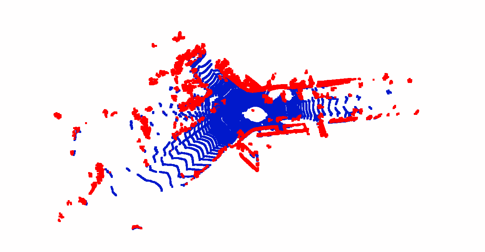
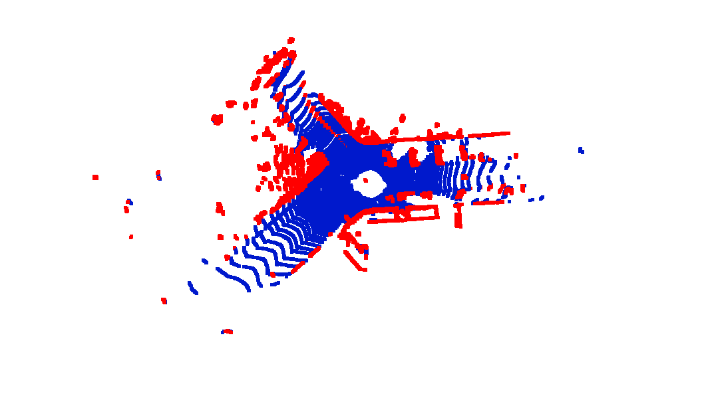
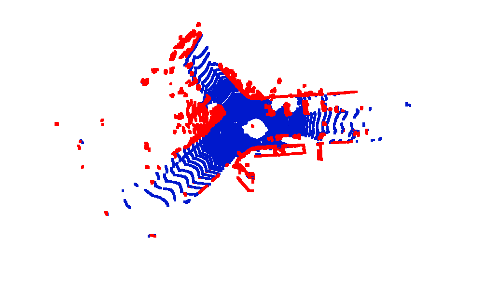
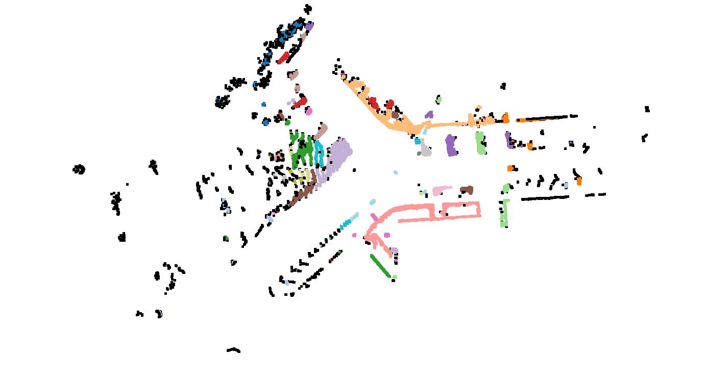
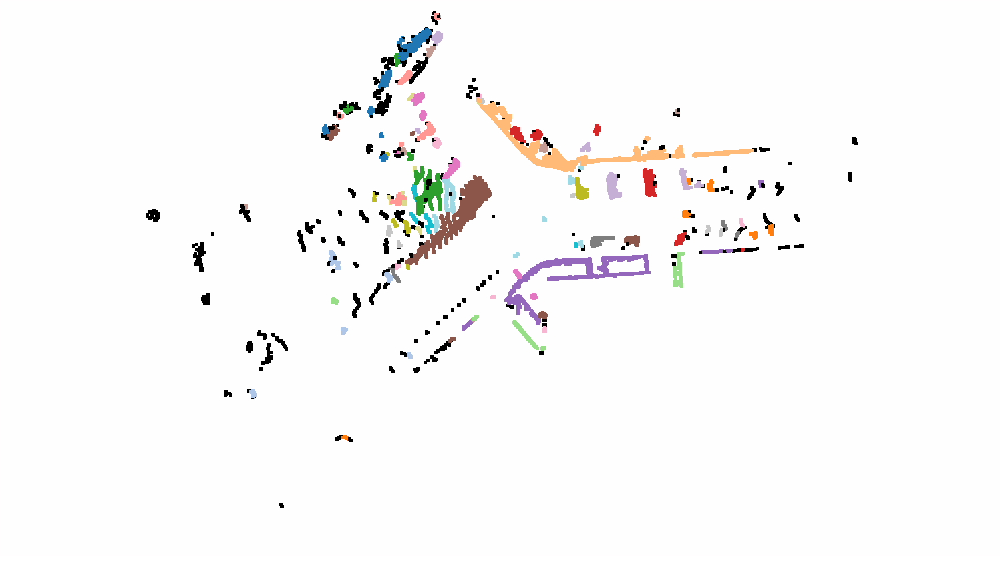

# 4. Model Fitting 

## 1. Ground Filter

* This ground filter are implemented as **a combination of RANSAC and Robust Least Square plane fitting**. RANSAC offers an good initial guess of the plane parameter and corresponding inner points, which are used for optimization using robust least square methods. In addition, robust least square methods are solved by gradient descent with backtracking. Because matrix inverse is so expensive for points clouds. Unfortunately, the combination of two methods are quite slow. Since this course is a fundamental course, so i would like to implement such an algorithms and see how it works. 

*  **Pipline**: 

  ~~~ python
  def ground_segmentation(data, threshold = 0.15):
      # 作业1
      # 屏蔽开始  
      data_list = list(data)
      plane_param = ransac(data_list, threshold)
      print("Plane parameter after ransac: ", plane_param)
  
      segmented_cloud, ground_cloud = split_points(data_list, plane_param, 0.25)
      print('segmented data points after ransac num:', segmented_cloud.shape[0])
      print('ground points after ransac num:', data.shape[0] - segmented_cloud.shape[0])
      
      plane_param = least_square(ground_cloud, plane_param, max_iter = 800, learning_rate = 1e-5, eps_param = 0.0001)
      segmented_cloud, ground_cloud = split_points(data_list, plane_param, 0.3)
      
      print("Plane parameter after least square: ", plane_param[0], plane_param[1], plane_param[2], plane_param[3],)
      print('origin data points num:', data.shape[0])
      print('segmented data points after lsq num:', segmented_cloud.shape[0])
      print('ground points after lsq num:', data.shape[0] - segmented_cloud.shape[0])
      return segmented_cloud, ground_cloud
  ~~~

* **Result**: It seems to offer a good performance.

  

      
      
Fig.1 Result of ground filter. blue: ground, red: other points

  
 

* In order to see the improvement of adding robust least square. Let us run it seperately.
  * **Parameter**: 
    * RANSAC:  
      * ***threshold***: 0.15
      *  ***max_iteration***: 100
    * Robust Least Square: 
      * ***Terminat condition***: max_iteration & norm of gradient & parameter changes
      * ***max iteration***:2000
    * Tolerance of the ground plane is 0.15, which means the inner points are choicen above and below 0.15m of the ground plane.
  * As it can be seen in Fig.2. The segmentation result is slightly better by optimizing the plane parameter extraly. 
  
  

      
      
Fig.2 left: RANSAC right: RANSAC + robust LSQ

  
 

  * There is also some state-of-the-art method beyond the methods above,  example 
    http://www.ipb.uni-bonn.de/pdfs/bogoslavskyi16pfg.pdf. Just mark it for future learning.
  
## 2. Clustering
* In this case, DBSCAN will be used for clustering. The fundamental idea is not so clear in the lecture, so i have search for some helper materials and learn how to implement DBSCAN from  https://github.com/xueliang2007/PointCloud-ShenLan/blob/master/chapter3/DBSCAN.py
* **Parameter**: 
  * ***r*** = 0.5
  * ***min_samples***: 10
* **Result**:
   

      
      
Fig.3 Clustering result

  
 

* Compare with the dbscan of open3d,  the performance is similar but much faster than self implemented dbscan.
   

      
      
Fig.4 Clustering result

  
 
  
  