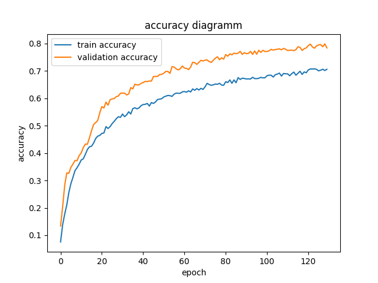

# ch5. Deep learning for Object Classification

## 1. PointNet
### 1.1. Short recap of PointNet
The constraints of point cloud: 
  * Point clouds are unordered. Algorithms has to be invariant to permutations of the input set.
  * If we rotates a chair, it is still a chair. Network must be invatiant to rigid transformation.
  * Network should capture interactions among points.

  PointNet introduces a neural network that takes all these properties into account. In this part, the implementation of PointNet as well as the structure of network pipline will be introduced.

### 1.2. Project Pipline
This main components of deep learning in pytorch are **dataloader, model, train pipline and evaluation pipline and some utils**. Model, dataloader, argparser and util script are under utils. Besides, train and eval are directly under current workspace. Because train and eval script will be explicitely used for train and test the networks.
* ***Dataloader***: The work flow of loading data is to define dataset and dataloader. Dataset indicates a dataset object to load data from PyTorch. User can define own getitem and some constructors. For efficiency, we'd better read data from file at the constructor. getitem just "get the item at the index". Dataloader represnets a Python iterable over a dataset.
* Testing dataloader is very necessary and helpful for debugging the whole project. Because model and loss are queit intuitive and simple, but dataloader is somehow implicitly represents the dataset. So visualization of it might help you to get more confident for you code.
  ~~~python
  class ModelNetDataset(torch.utils.data.Dataset):
    
    def __init__(self, cloud_folder, data_mode = 'train', data_augmentation = True, num_class_to_use : int=10):
        assert data_mode in ['train', 'validation', 'test'] 
        self.cloud_folder_ = cloud_folder
        self.data_augmentation_ = data_augmentation
        self.data_mode_ = data_mode
        self.clouds_labels_ = [] 
        self.num_class_to_use_ = num_class_to_use
        self.data_mode_ = data_mode
        self.labels = None
        self.get_clouds_labels_from_txt_file()
    
    def get_clouds_labels_from_txt_file(self):
        """[get clouds and labels from off file for all object]

        Args:
            cloud_folder_path ([str]): [the file of this object]
            data_mode (str, optional): [choices from train, test]. Defaults to 'train'.
        """
        cat = os.listdir(self.cloud_folder_)
        self.labels = cat
        cat_ = copy.deepcopy(cat)
        for item in cat_:
            if item.endswith('.txt') == True:
                cat.remove(item)
        
                
        for i in range(len(cat)):
            if i == self.num_class_to_use_:
                break
            current_cloud_folder =  os.path.join(self.cloud_folder_, cat[i])
            clouds = os.listdir(current_cloud_folder)
            label = current_cloud_folder.split('/')[-1] 
            num_label = cat.index(label)
            print("Start loading {}....".format(label))
            num_clouds = len(clouds)
            
            for id_, cloud in enumerate(tqdm.tqdm(clouds)):
                if self.data_mode_ == 'train':
                    if id_ < 0.5 * num_clouds:
                        current_cloud_path = os.path.join(current_cloud_folder, cloud)
                        points = read_cloud_from_txt(current_cloud_path)
                        self.clouds_labels_.append([points, num_label])
                elif self.data_mode_ == 'validation':
                    if 0.5 * num_clouds <= id_ < 0.8 * num_clouds:   
                        current_cloud_path = os.path.join(current_cloud_folder, cloud)
                        points = read_cloud_from_txt(current_cloud_path)
                        self.clouds_labels_.append([points, num_label])
                else:
                    if id_ >= 0.8 * num_clouds:    
                        current_cloud_path = os.path.join(current_cloud_folder, cloud)
                        points = read_cloud_from_txt(current_cloud_path)
                        self.clouds_labels_.append([points, num_label])
                    
    def __getitem__(self, index):

        cloud_label = self.clouds_labels_[index] 
        
        cloud = cloud_label[0] 
        
        # data augmentation
        if self.data_augmentation_:
            theta = np.random.uniform(0, np.pi * 2)
            rotation_matrix = np.array([[np.cos(theta), -np.sin(theta)],[np.sin(theta), np.cos(theta)]])
            cloud[:,[0,2]] = cloud[:,[0,2]].dot(rotation_matrix) # random rotation
            cloud += np.random.normal(0, 0.02, size=cloud.shape) # random jitter
        
        return cloud, cloud_label[1]   
    
    def __len__(self):
        return len(self.clouds_labels_)
  ~~~
* ***Model***: Model of PointNet is a very simple and fundamental version, which includes only conv1d, fully connected layer and some necessary parts sequentially. To provide **permutation invatiance**, PointNet apply a max function to the extracted and transformed features so the result does not depend on the order of input points anymore.
  
  ~~~python
  class PointNet(torch.nn.Module):
    def __init__(self, num_class: int =10):
        super(PointNet, self).__init__()
        self.num_class_ = num_class
        self.dropout = torch.nn.Dropout(p=0.7)
        
        self.conv1 = torch.nn.Conv1d(3, 64, 1)
        #self.conv2 = torch.nn.Conv1d(64, 64, 1)
        self.conv2 = torch.nn.Conv1d(64, 128, 1)
        self.conv3 = torch.nn.Conv1d(128, 1024, 1)
        
        self.fc1 = torch.nn.Linear(1024, 512)
        self.fc2 = torch.nn.Linear(512, 256)
        self.fc3 = torch.nn.Linear(256, self.num_class_)
        
        self.bn1 = torch.nn.BatchNorm1d(64)
        self.bn2 = torch.nn.BatchNorm1d(128)
        self.bn3 = torch.nn.BatchNorm1d(1024)
        self.bn4 = torch.nn.BatchNorm1d(512)
        self.bn5 = torch.nn.BatchNorm1d(256)
        
        self.relu = torch.nn.ReLU(inplace=True)
        
    def forward(self, x):
        #import pdb; pdb.set_trace()
        batch_size = x.shape[0]
        x = F.relu(self.bn1(self.conv1(x)))
        x = F.relu(self.bn2(self.conv2(x)))
        x = F.relu(self.bn3(self.conv3(x)))
        
        x = torch.max(x, 2, keepdim=True)[0] # let net invariant for rotation and permutation
        x = x.view(-1, 1024)
        
        x = F.relu(self.bn4(self.dropout(self.fc1(x))))
        x = F.relu(self.bn5(self.dropout(self.fc2(x))))
        x = self.fc3(x)

        return x
  ~~~

* ***Loss***: For classification task is well used cross entropy, which is
  ~~~python
  criterion = torch.nn.CrossEntropyLoss()
  ~~~

* ***Train pipline***: 
  * Split data into train and validation data, in order to monitor the quality of the learning process at each epoch.
  * Save the best model, if validation_loss is currently the best (smallest).
  * Save two plots, one is train & val loss, the other is train & val accuracy.
  
  ~~~python
  def train(args):
    
    create_experiment_dir(args.exp_dir)
    # cloud_folder_path = '/mvtec/home/jinx/privat/modelnet40_normal_resampled'
    
    train_loader = load_data(cloud_folder_path=args.data_dir, data_mode='train',batch_size=args.batch_size, num_class=args.num_class)
    val_loader = load_data(cloud_folder_path=args.data_dir, data_mode='validation',batch_size=args.batch_size, num_class=args.num_class)
    
    print("@@@@@Load model...")
    model = PointNet(num_class=args.num_class)
    
    if torch.cuda.is_available():
        model = model.cuda()
    
    print("Start to train the networks...")
    
    train_loss_history = []
    validation_loss_history = []
    train_accuracy_history = [] 
    val_accuracy_history = [] 
    counter = [] 
    best_validation_loss = float('inf')

    for curr_epoch in range(args.num_epochs):
        counter.append(curr_epoch)
        train_loss_per_epoch, train_accuracy_per_epoch = run_epoch(data_loader = train_loader, model = model, mode='train', learning_rate=args.learning_rate, weight_decay=args.weight_decay)
        validation_loss_per_epoch, val_accuracy_per_epoch = run_epoch(data_loader = train_loader, model = model, mode='validation')

        train_loss_history.append(train_loss_per_epoch)
        validation_loss_history.append(validation_loss_per_epoch)
        
        train_accuracy_history.append(train_accuracy_per_epoch)
        val_accuracy_history.append(val_accuracy_per_epoch)
        
        print_info(curr_epoch, train_loss_per_epoch, train_accuracy_per_epoch, validation_loss_per_epoch, val_accuracy_per_epoch)
        
        if validation_loss_per_epoch < best_validation_loss:
            save_model_path = args.exp_dir + '/train/best_model.pth'
            torch.save(model.state_dict(), save_model_path)
            
        # save and rewrite the train & validation loss for each 10 epoch, save and plot it for each 50 epochs   
        plt.subplots() 
        plt.plot(counter,train_loss_history, label = 'train loss')
        plt.plot(counter,validation_loss_history, label = 'validation loss')
        plt.legend()
        plt.xlabel('epoch')
        plt.ylabel('loss')
        plt.title('loss diagramm')
        fig_file_name = 'current_loss.png'
        save_path = os.path.join(args.exp_dir + '/train/', fig_file_name)
        plt.savefig(args.exp_dir + '/train/' + fig_file_name)  
        
        plt.subplots() 
        plt.plot(counter,train_accuracy_history, label = 'train accuracy')
        plt.plot(counter,val_accuracy_history, label = 'validation accuracy')
        plt.legend()
        plt.xlabel('epoch')
        plt.ylabel('accuracy')
        plt.title('accuracy diagramm')
        fig_file_name = 'current_accuracy.png'
        save_path = os.path.join(args.exp_dir + '/train/', fig_file_name)
        plt.savefig(args.exp_dir + '/train/' + fig_file_name)  
        
        plt.close('all')
  ~~~

* ***Plots***: 
  

    
    
Fig.1 left: loss diagramm right: accuracy diagramm 

* ***Evaluation pipline***:
  * The classification quality on test dataset will be evaluated. In addition, the wrong classified objectes are written onto the classification report.txt, so that we can know which object at specific path are wrongly classified after evaluation.
  ~~~python
def evaluate(args):
      test_loader = load_data(cloud_folder_path=args.data_dir, data_mode='test',batch_size=args.batch_size, num_class=args.num_class)

      cur_time = round(time.time())
      report_path = '{}/eval/classification_report_{}.txt'.format(args.exp_dir, cur_time)
  
      os.system('touch {}/eval/classification_report_{}.txt'.format(args.exp_dir, cur_time))
  
      print("@@@@@Load model...")
      model = PointNet(num_class=args.num_class)
  
      if torch.cuda.is_available():
          model = model.cuda()
  
      print("Start to evaluate the networks...")
      model_path = os.path.join(args.exp_dir ,'train/best_model.pth')
      model.load_state_dict(torch.load(model_path))
      model.eval()
      criterion = torch.nn.CrossEntropyLoss()
  
      accuracy_list = []
      for i, data in enumerate(tqdm.tqdm(test_loader, 0)):
          points, target, data_path = data
          batch_size = points.shape[0]
          if torch.cuda.is_available():
              points, target = points.cuda(), target.cuda()
          
          pred = model(points)
          loss = criterion(pred, target)
  
          pred_choice = pred.data.max(1)[1]
          correct = pred_choice.eq(target.data).cpu().sum()
          acc = correct / batch_size
          accuracy_list.append(acc)
          f = open(report_path, 'a')
          #import pdb; pdb.set_trace()
          if correct == 0:
              f.write(data_path[0])
              f.write(" ")
              f.write(str(pred_choice.item()))
              f.write("\n")
              f.close()
              
      print("Done classification on", i, " point clouds")
      print('Average accuracy of the model is : ', np.mean(np.asarray(accuracy_list), axis = 0))
  ~~~
  
 * ***Result***:

  

    
    
Fig.2 Screen shot of accuracy on test data points

 

  

    
    
Fig.3. Report of wrong classification object with path

 

