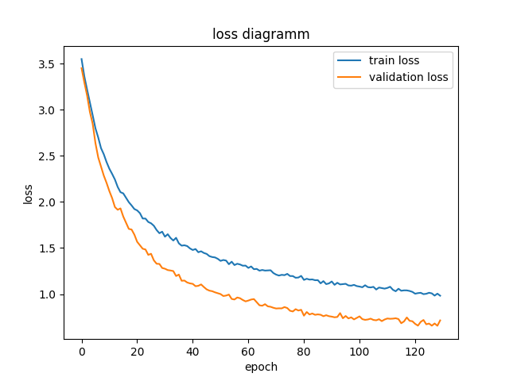
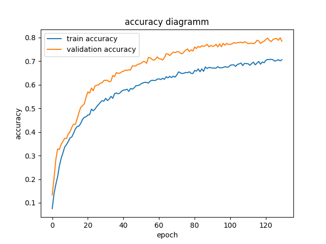
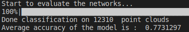
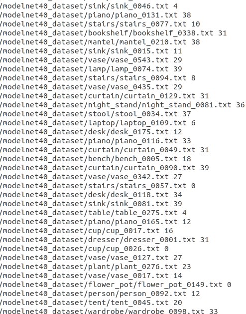

##Deep Learning for Point Cloud

1. **The Structure of a deep learning framework in PyTorch**
* The folder should contain at least following files and their functionalities: 
* model.py that implements the model structure as a class, which contains __init__ function to specify the layers, and forward function to specify how these layers are structured
* dataloader.py that implements how to load data and store them also as a class. Within it __get_item__ function and __len__ function are at minimum require. __get_item__ should at least return a indexed pointcloud and its label, more functionalities can be added such as data augumentation(random rotation for example)
* train.py that actually trains the network
* eval.py that test the network for its performence

So the basic structure should look like:
  ~~~ python
  import torch
  import numpy as np
  import torch.nn.functional as F

  class PointNet(torch.nn.Module):
    def __init__(self, num_class: int =10):
        super(PointNet, self).__init__()
        self.num_class_ = num_class
        self.dropout = torch.nn.Dropout(p=0.7)
        self.conv1 = torch.nn.Conv1d(3, 64, 1)
        self.conv2 = torch.nn.Conv1d(64, 128, 1)
        self.conv3 = torch.nn.Conv1d(128, 1024, 1)
        
        self.fc1 = torch.nn.Linear(1024, 512)
        self.fc2 = torch.nn.Linear(512, 256)
        self.fc3 = torch.nn.Linear(256, self.num_class_)
        
        self.bn1 = torch.nn.BatchNorm1d(64)
        self.bn2 = torch.nn.BatchNorm1d(128)
        self.bn3 = torch.nn.BatchNorm1d(1024)
        self.bn4 = torch.nn.BatchNorm1d(512)
        self.bn5 = torch.nn.BatchNorm1d(256)
        
        self.relu = torch.nn.ReLU(inplace=True)
        
    def forward(self, x):
        batch_size = x.shape[0]
        x = F.relu(self.bn1(self.conv1(x)))
        x = F.relu(self.bn2(self.conv2(x)))
        x = F.relu(self.bn3(self.conv3(x)))
        
        x = torch.max(x, 2, keepdim=True)[0]
        x = x.view(-1, 1024)
        
        x = F.relu(self.bn4(self.dropout(self.fc1(x))))
        x = F.relu(self.bn5(self.dropout(self.fc2(x))))
        x = self.fc3(x)

        return x
  ~~~
* The class inherited torch.nn.Module. Most functions are in torch.nn library, some are in torch.nn.funtional as well. For multiple classification task the last layer may not be activated, CrossEntroyLoss can be used in this case later on

~~~ python
class ModelNetDataset(torch.utils.data.Dataset):
    
    def __init__(self, cloud_folder, data_mode = 'train', data_augmentation = True, num_class_to_use : int=10):
        assert data_mode in ['train', 'validation', 'test'] 
        self.cloud_folder_ = cloud_folder
        self.data_augmentation_ = data_augmentation
        self.data_mode_ = data_mode
        self.clouds_labels_ = [] 
        self.num_class_to_use_ = num_class_to_use
        self.data_mode_ = data_mode
        self.labels = None
    
                    
    def __getitem__(self, index):
        cloud_label = self.clouds_labels_[index] 
        cloud = cloud_label[0] 
        # data augmentation
        if self.data_augmentation_:
            theta = np.random.uniform(0, np.pi * 2)
            rotation_matrix = np.array([[np.cos(theta), -np.sin(theta)],[np.sin(theta), np.cos(theta)]])
            cloud[:,[0,2]] = cloud[:,[0,2]].dot(rotation_matrix) # random rotation
            cloud += np.random.normal(0, 0.02, size=cloud.shape) # random jitter
        return cloud, cloud_label[1], cloud_label[2]
    
    def __len__(self):
        return len(self.clouds_labels_)
~~~
* This is just an example, may not indicates the fully functional code
~~~python
    cloud_dataset = ModelNetDataset(cloud_folder=cloud_folder_path, data_mode=data_mode, num_class_to_use=num_class)
    cloud_loader = torch.utils.data.DataLoader(cloud_dataset, batch_size = batch_size, shuffle = True, num_workers = 8)

    optimizer = torch.optim.Adam(model.parameters(),lr = learning_rate,  weight_decay=weight_decay)
    criterion = torch.nn.CrossEntropyLoss()

    for i, data in enumerate(tqdm.tqdm(cloud_loader, 0)):
        point, label, _ = data
        batch_size = point.shape[0]
        
        if torch.cuda.is_available():
            point, label = point.cuda(), label.cuda()

        if mode == 'train':
            optimizer.zero_grad()
            predict = model.forward(point)
            loss_ = criterion(predict, label)
            loss_.backward()
            optimizer.step()
        
        else:
            predict = model.forward(point)
            loss_ = criterion(predict, label)

        pred_choice = predict.data.max(1)[1]
        correct = pred_choice.eq(label.data).cpu().sum()
        loss_list.append(loss_.item())
        accuracy_list.append(correct / batch_size)
        
    loss_return = np.mean(np.asarray(loss_list))
    accuracy_return = np.mean(np.asarray(accuracy_list))
    
    return loss_return, accuracy_return

    save_model_path = 'some_path ***'.format(curr_epoch)
    torch.save(model.state_dict(), save_model_path)
~~~

2.**Evaluation after training on ModelNet40 dataset**
  

    
    
Fig.1 Loss trend over 130 epochs

  

  

    
    
Fig.2 Accuracy over 130 epochs

  

  

    
    
Fig.3 Evaluation accuracy

  

  

    
    
Fig.4 Wrongly classified objects

  
