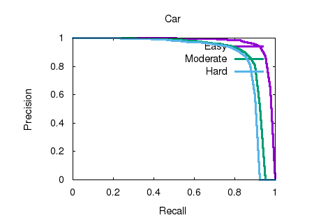

# ch7 Object Detection

## 1. Summary of the contribution
 In this homework, we have learned PointRCNN and the evaluation strategy by testing the detection performance using KITTI dataset. Because of the limitation of device, we used the pretrained model for evaluation. 

 We will introduce how we built the whole workspace as well as the dataset. 

 ## 2. Whole Project Structure
 ### 1. Workspace
 * We downloaded 
   * PointRCNN on https://github.com/sshaoshuai/PointRCNN
   *  kitti_eval on https://github.com/prclibo/kitti_eval.git and 
   *  devkit on http://www.cvlibs.net/datasets/kitti/eval_object.php?obj_benchmark=3d(Download object development kit (1MB))

### 2. Dataset
* Generate a folder named object, where training and testing are put. 
* Download KITTI dataset on KITTI website, organise the downloaded datas like PointRCNN describes.
  
### 3. Test PointRCNN
* We used pretrained model to test the performance of the algorithm via 
 ~~~ pytho
 python eval_rcnn.py --cfg_file cfgs/default.yaml --ckpt PointRCNN.pth --batch_size 1 --eval_mode rcnn --set RPN.LOC_XZ_FINE False
~~~
Then we got the output folders, which contains some relevant results.

### 4.Evaluation of PointRCNN
* We used kitti_eval for evaluating the results of PointRCNN with 
  ~~~ python 
  ./evaluate_object_3d_offline ../PointRCNN/data/KITTI/object/training/label_2 ../PointRCNN/output/rcnn/default/eval/epoch_no_number/val/final_result 
  ~~~

  **Attension**: You should not type 'data' in the command line for ***result dir***, because of the requirement of the code.
  Line 820 of kitti_eval/evaluate_object_3d_offline.cpp
  ~~~ c++
  std::vector<int32_t> indices = getEvalIndices(result_dir + "/data/");
  ~~~
  which means getEvalIndices want a result_dir, where data dir is under result_dir.

### 5. Evaluate Result

    
     
    
Fig.Car_detection_3d

    
     
    
Fig.Car_detection

    
     
    
Fig.Car_detection_ground

    
     
    
Fig.Car_orientation

