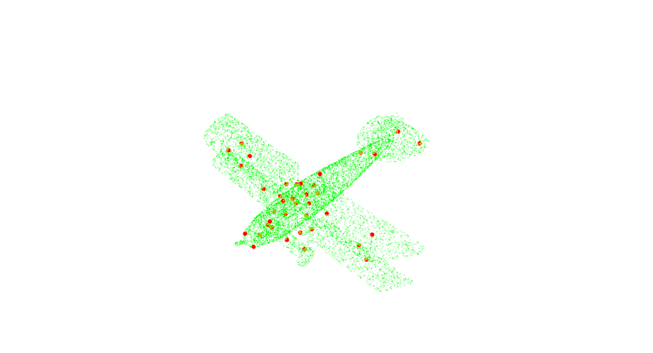
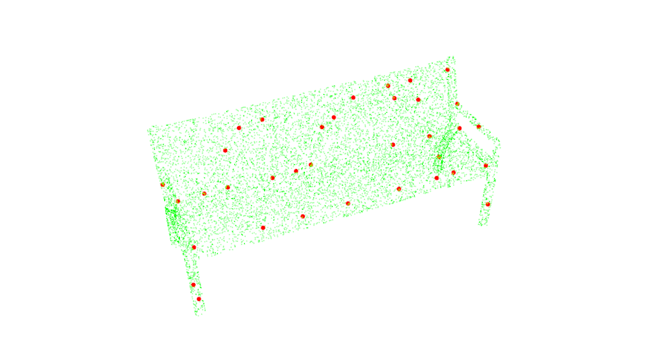
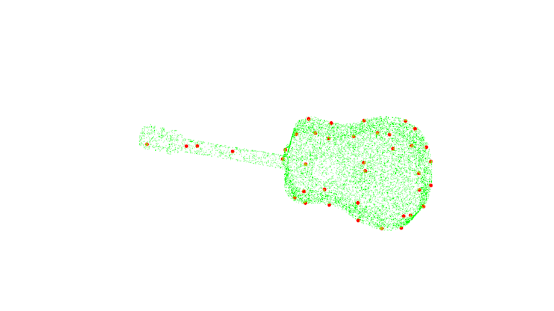

##3D Feature Detection

---------------
Runtime is around 13 seconds for 10000 points. Significantly slower than pcl build-in API. Maybe because they use multi-threding
1.**Test file**
~~~c++
    #include <pcl/registration/ia_ransac.h>
    #include <pcl/point_types.h>
    #include <pcl/point_cloud.h>
    #include <pcl/features/normal_3d.h>
    #include <pcl/features/fpfh.h>
    #include <pcl/search/kdtree.h>
    #include <pcl/io/pcd_io.h>
    #include <pcl/io/ply_io.h>
    #include <pcl/filters/filter.h>
    #include <pcl/registration/icp.h>
    #include <pcl/visualization/pcl_visualizer.h>
    #include <time.h>
    #include <pcl/common/io.h>
    #include <iostream>
    #include <pcl/keypoints/iss_3d.h>//关键点检测
    #include <iss.h>

    using pcl::NormalEstimation;
    using pcl::search::KdTree;
    typedef pcl::PointXYZ PointT;
    typedef pcl::PointCloud<PointT> PointCloud;

    //点云可视化
    void visualize_pcd(PointCloud::Ptr pcd_src,
        PointCloud::Ptr pcd_tgt)
        //PointCloud::Ptr pcd_final)
    {
        pcl::visualization::PCLVisualizer viewer("registration Viewer");

        pcl::visualization::PointCloudColorHandlerCustom<pcl::PointXYZ> src_h(pcd_src, 0, 255, 0);
        pcl::visualization::PointCloudColorHandlerCustom<pcl::PointXYZ> tgt_h(pcd_tgt, 255, 0, 0);
        //pcl::visualization::PointCloudColorHandlerCustom<pcl::PointXYZ> final_h(pcd_final, 0, 0, 255);
        viewer.setBackgroundColor(255, 255, 255);
        viewer.addPointCloud(pcd_src, src_h, "source cloud");
        viewer.addPointCloud(pcd_tgt, tgt_h, "tgt cloud");
        //viewer.addPointCloud(pcd_final, final_h, "final cloud");
        
        viewer.setPointCloudRenderingProperties(pcl::visualization::PCL_VISUALIZER_POINT_SIZE, 7, "tgt cloud");
        while (!viewer.wasStopped())
        {
            viewer.spinOnce(100);
            boost::this_thread::sleep(boost::posix_time::microseconds(100000));
        }

        //pcl中sift特征需要返回强度信息，改为如下:
    }

    int main(int argc, char** argv)
    {
        std::string path = argv[1];
        //加载点云文件
        PointCloud::Ptr input_cloud(new PointCloud);//原点云，待配准
        //"/home/gfeng/gfeng_ws/point_cloud_processing/ch7_Feature_detection/data/airplane.ply"
        if(pcl::io::loadPLYFile(path, *input_cloud) == -1){
            PCL_ERROR ("Couldn't read file\n");
            return (-1);
        }
        std::cout << "/////////////////////////////////////////////////" <<std::endl;
        std::cout << "原始点云数量："<<input_cloud->size() <<std::endl;

        clock_t start = clock();

        //pcl::PointCloud<pcl::PointXYZ>::Ptr model_keypoint(new pcl::PointCloud<pcl::PointXYZ>());
        ISSKeypoint iss;
        PointCloud::Ptr keypointscloud(new PointCloud);
        double model_solution = 0.4;//参数小，采取的关键点多，论文中为500左右

        //参数设置
        iss.useWeightedCovMat(true);
        iss.setLocalRadius(0.12);
        iss.setNonMaxRadius(0.08);
        iss.setThreshold(0.975, 0.975);
        iss.setMinNeighbors(5);
        iss.setInputPointCloud(input_cloud);
        iss.compute(keypointscloud);

        clock_t end = clock();
        cout << "iss关键点提取时间:" << (double)(end - start) / CLOCKS_PER_SEC << endl;
        cout << "iss关键点数量" << keypointscloud->size() << endl;
        
        PointCloud::Ptr cloud_src(new PointCloud);
        pcl::copyPointCloud(*keypointscloud, *cloud_src);

        //可视化
        visualize_pcd(input_cloud, cloud_src);
        return 0;
    }
~~~

2.**Source File**
~~~c++
    #pragma once
    #include <cstdint>
    #include <iostream>
    #include <vector>
    #include "Eigen/Dense"
    #include <pcl/io/pcd_io.h>
    #include <pcl/point_types.h>
    #include <pcl/visualization/cloud_viewer.h>
    #include <pcl/kdtree/kdtree_flann.h>

    typedef pcl::PointCloud<pcl::PointXYZ>::Ptr CloudPtr;
    class ISSKeypoint
    {
    public:
        void useWeightedCovMat(bool use);
        void setLocalRadius(float r);
        void setNonMaxRadius(float r);
        void setThreshold(float g21, float g32);
        void setMinNeighbors(int n);
        void setInputPointCloud(CloudPtr input_point_cloud);
        void compute(CloudPtr keypoints);
        
    private:
        Eigen::Vector3f getEigenvalues(size_t i);

    private:
        bool use_w_cov_mat;
        float local_radius;
        float non_max_radius;
        float gamma21, gamma32;
        int min_neighbors;
        CloudPtr point_cloud;
        std::vector<std::vector<int>> neighbors;
    };
~~~
~~~c++
    #include "iss.h"

    void ISSKeypoint::useWeightedCovMat(bool use){
        this->use_w_cov_mat = use;
    }

    void ISSKeypoint::setLocalRadius(float r){
        this->local_radius = r;
    }

    void ISSKeypoint::setNonMaxRadius(float r){
        this->non_max_radius = r;
    }

    void ISSKeypoint::setThreshold(float g21, float g32){
        this->gamma21 = g21;
        this->gamma32 = g32;
    }

    void ISSKeypoint::setMinNeighbors(int n){
        this->min_neighbors = n;
    }

    void ISSKeypoint::setInputPointCloud(CloudPtr cld){
        this->point_cloud = cld;
        this->neighbors.resize(point_cloud->size());
    }

    void ISSKeypoint::compute(CloudPtr keypoints){

        pcl::KdTreeFLANN<pcl::PointXYZ> kdtree;
        kdtree.setInputCloud(this->point_cloud);
        std::vector<float> potkps(point_cloud->size(), -1);
        for(int i = 0; i < this->point_cloud->size(); i++){
            // Neighbors within radius search
            std::vector<float> pointRadiusSquaredDistance;
            pcl::PointXYZ searchPoint = this->point_cloud->points[i];
            kdtree.radiusSearch(searchPoint, this->local_radius, neighbors[i], pointRadiusSquaredDistance);
        }

        for(int i = 0; i < point_cloud->size(); i++){
            std::cout<<"processing "<<i<<"th point"<<std::endl;
            if(neighbors[i].size() > min_neighbors){
                
            //create weighted cov
                pcl::PointXYZ cur_point = point_cloud->points[i];
                Eigen::Vector3f center_point{(*point_cloud)[i].x,
                                            (*point_cloud)[i].y,
                                            (*point_cloud)[i].z};
                Eigen::Matrix3f cov_matrix = Eigen::Matrix3f::Zero(3, 3);
                if(use_w_cov_mat){
                    float weight;
                    float weight_sum = 0;
                    for(int j = 0; j < neighbors[i].size(); j++){
                        weight = 1.0f / neighbors[neighbors[i][j]].size();
                        if(weight == 0){
                            throw std::runtime_error("no neighbor");
                        }
                        weight_sum += weight;
                        Eigen::Vector3f neighbor{(*point_cloud)[neighbors[i][j]].x,
                                                (*point_cloud)[neighbors[i][j]].y,
                                                (*point_cloud)[neighbors[i][j]].z};
                        //std::cout<<neighbor<<std::endl;
                        cov_matrix += weight * (neighbor - center_point) * (neighbor - center_point).transpose();
                        //std::cout<<cov_matrix<<std::endl;
                    }
                    cov_matrix = cov_matrix / weight_sum;
                    //std::cout<<cov_matrix<<std::endl;
                }
                else{
                    for(int j = 0; j < neighbors[i].size(); j++){
                        Eigen::Vector3f neighbor{(*point_cloud)[neighbors[i][j]].x,
                                                (*point_cloud)[neighbors[i][j]].y,
                                                (*point_cloud)[neighbors[i][j]].z};
                        cov_matrix += (center_point - neighbor) * (center_point - neighbor).transpose();
                    }
                    cov_matrix = cov_matrix / neighbors[i].size();
                }
                //find eigenvalues
                Eigen::SelfAdjointEigenSolver<Eigen::Matrix3f> eigensolver(cov_matrix);
                Eigen::Vector3f eigenvalues = eigensolver.eigenvalues().real();
                //std::cout<<eigenvalues<<std::endl;
                if(eigenvalues[1] / eigenvalues[2] < gamma21 && eigenvalues[0] / eigenvalues[1] < gamma32 && eigenvalues[0] > 0){
                    potkps[i] = eigenvalues[0];
                }
            }
        }
        //nonmax supression
        for (int i = 0; i < point_cloud->size(); i++)
        {
            if (potkps[i] == -1) continue;

            std::vector<float> pointRadiusSquaredDistance;
            std::vector<int> indices;
            pcl::PointXYZ searchPoint = this->point_cloud->points[i];
            kdtree.radiusSearch(searchPoint, this->non_max_radius, indices, pointRadiusSquaredDistance);
            if (indices.size() < min_neighbors) continue;

            bool is_keypoint = true;
            for (const int& dist_idx : indices)
                if (potkps[i] < potkps[dist_idx])
                {
                    is_keypoint = false;
                    break;
                }

            if (is_keypoint)
                keypoints->push_back(point_cloud->points[i]);

        }
    }
~~~

    
     
    
Fig1.airplane with keypoints

    
     
    
Fig2.bench with keypoints

    
     
    
Fig3.guitar with keypoints

