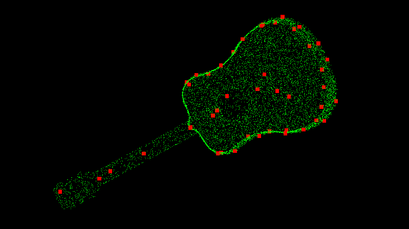
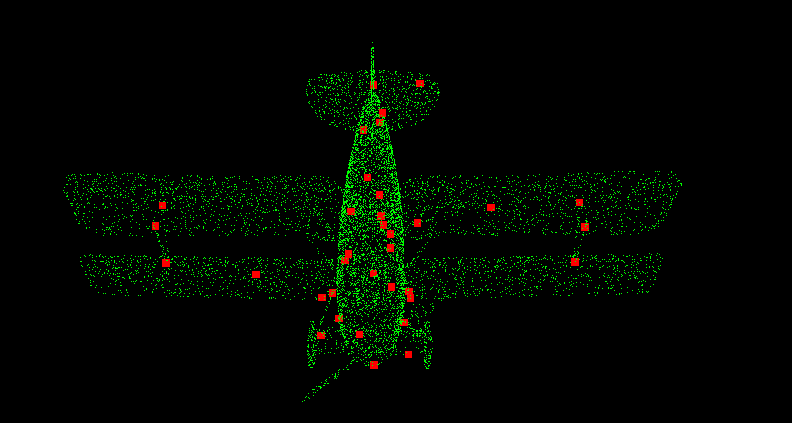
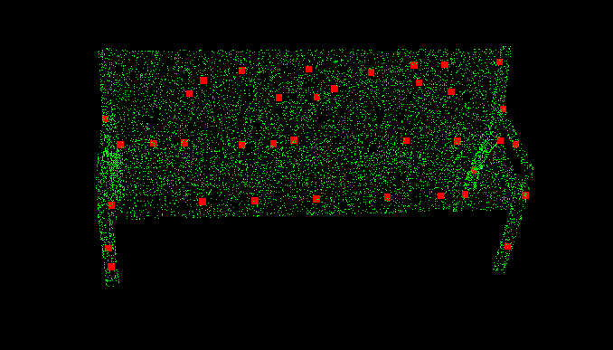

# ch7 Feature Detection

## Intrinsic shape signature
* In this homework, ISS is implemented by c++. /test/test_iss_pcl uses pcl library while in /test/test_my_iss.cpp ISS is implemented from scratch.
* The idea of ISS is simple. At first, compute RNN of all points. Then, use the nearest neighbors to compute covariance matrix and get the valid point through the eigenvalue condition. At last, use non-max-suppression to suppress the points, whose lamda3 is not the max value in the region.
* The main code is as followings.
~~~ c++
void ISSKeypoints::compute(pcl::PointCloud<pcl::PointXYZ>::Ptr key_points) {

  // build kdtree
  pcl::KdTreeFLANN<pcl::PointXYZ> kdtree;
  kdtree.setInputCloud(this->point_cloud_);
  int num_points = this->point_cloud_->size();

  // compute rnn indices of all points
  std::vector<std::vector<int>> rnn_indices(num_points);
  for (int i = 0; i < num_points; i++) {
    // std::cout << this->point_cloud_->points[i] << '\n';
    pcl::PointXYZ search_point = this->point_cloud_->points[i];
    std::vector<float> distances;
    std::vector<int> rnn_idx;
    kdtree.radiusSearch(search_point, this->rnn_radius_, rnn_idx, distances);
    rnn_indices[i] = rnn_idx;
  }

  std::vector<float> lamda3_vec(num_points, -1);
  // compute covariance matrix for each point
  for (int i = 0; i < num_points; i++) {
    // std::cout << "Process the " << i << "-th point" << '\n';
    int num_neighbors = rnn_indices[i].size();

    // compute covariance matrix for each point
    if (num_neighbors > this->min_neighbors_) {
      Eigen::Vector3f center_point{this->point_cloud_->points[i].x,
                                   this->point_cloud_->points[i].y,
                                   this->point_cloud_->points[i].z};

      Eigen::Matrix3f cov_matrix = Eigen::Matrix3f::Zero(3, 3);
      if (this->use_weighted_conv_matrix_) {
        float weight_sum = 0.f;
        float weight;
        for (int j = 0; j < num_neighbors; j++) {
          int idx_neighbors = rnn_indices[i][j];
          weight = 1.f / rnn_indices[idx_neighbors].size();
          Eigen::Vector3f neighbor_point{
              (*this->point_cloud_)[idx_neighbors].x,
              (*this->point_cloud_)[idx_neighbors].y,
              (*this->point_cloud_)[idx_neighbors].z};

          cov_matrix += weight * (neighbor_point - center_point) *
                        (neighbor_point - center_point).transpose();
          weight_sum += weight;
        }
        cov_matrix /= weight_sum;
        // std::cout << "Covariance matrix" << '\n';
        // std::cout << cov_matrix << '\n';
        // std::cout << '\n';
      }

      else {
        float weight_sum = 0.f;
        for (int j = 0; j < num_neighbors; j++) {
          int idx_neighbors = rnn_indices[i][j];

          Eigen::Vector3f neighbor_point{
              (*this->point_cloud_)[idx_neighbors].x,
              (*this->point_cloud_)[idx_neighbors].y,
              (*this->point_cloud_)[idx_neighbors].z};

          cov_matrix += (neighbor_point - center_point) *
                        (neighbor_point - center_point).transpose();
        }
        cov_matrix /= num_neighbors;
      }

      // compute eigenvalues, tipps: this eigenvalue is lamda1 < lamda2 < lamda3
      Eigen::SelfAdjointEigenSolver<Eigen::Matrix3f> eigensolver(cov_matrix);
      Eigen::Vector3f eigenvalues = eigensolver.eigenvalues().real();
      float lamda1 = eigenvalues[2];
      float lamda2 = eigenvalues[1];
      float lamda3 = eigenvalues[0];
      // std::cout << lamda1 << s" " << lamda2 << " " << lamda3 << '\n';
      if (lamda2 / lamda1 < this->gamma21_ &&
          lamda3 / lamda2 < this->gamma32_ && lamda3 > 0) {
        // std::cout << "This point is key spoint" << '\n';
        lamda3_vec[i] = lamda3;
      }
    }
  }

  for (auto lam3 : lamda3_vec)
    std::cout << lam3 << " ";
  std::cout << std::endl;

  // apply non-max_suppression
  for (int i = 0; i < num_points; i++) {
    if (lamda3_vec[i] == -1) {
      continue;
    }
    bool is_key_point = true;
    pcl::PointXYZ search_point = this->point_cloud_->points[i];
    std::vector<float> distances;
    std::vector<int> rnn_idx;
    kdtree.radiusSearch(search_point, this->non_max_radius_, rnn_idx,
                        distances);

    if (rnn_idx.size() < this->min_neighbors_) {
      continue;
    }

    for (const auto &dist_idx : rnn_idx) {
      if (lamda3_vec[i] < lamda3_vec[dist_idx]) {
        is_key_point = false;
        break;
      }
    }

    if (is_key_point) {
      std::cout << "Find a key points points[" << i << "]" << '\n';
      key_points->push_back(this->point_cloud_->points[i]);
      std::cout << "Key point: " << this->point_cloud_->points[i] << '\n';
    }
  }
}
~~~

* The result of ISS on three objects in ModelNet40 are as follows:

     
     
     
    
Fig.1. ISS keypoints detector in three objects.

